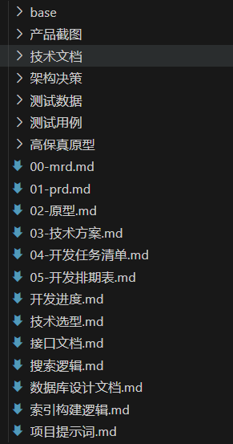

# 小遥搜索 XiaoyaoSearch


## 📖 项目简介


小遥搜索是一款专为知识工作者、内容创作者和技术开发者设计的跨平台本地桌面应用（Windows/MacOS/Linux）。通过集成的AI模型，支持语音输入（30秒内）、文本输入、图片输入等多种方式，将用户的查询转换为语义进行智能搜索，实现对本地文件的深度检索。

## ⭐️ 重要说明
- 本项目个人使用完全免费，但不得修改后二次分发；商业目的需授权，详细见[小遥搜索软件授权协议](LICENSE)
- 本项目完全通过Vibe Coding实现，提供所有源码及开发文档（上下文）供大家交流学习
  

## 作者介绍
- dtsola【IT解决方案架构师 | 一人公司实践者】
- 网站：https://www.dtsola.com
- B站：https://space.bilibili.com/736015
- 微信：dtsola（如需联系，请备注你的来意）


### ✨ 核心特性

- **🎤 多模态输入**：支持语音录音、文本输入、图片上传
- **🔍 深度检索**：支持视频（mp4、avi）、音频（mp3、wav）、文档（txt、markdown、office、pdf）的内容和文件名搜索
- **🧠 AI增强**：集成BGE-M3、FasterWhisper、CN-CLIP、OLLAMA等先进AI模型
- **⚡ 高性能**：基于Faiss向量搜索和Whoosh全文搜索的混合检索架构
- **🔒 隐私安全**：本地运行，数据不上传云端，支持隐私模式
- **🎨 现代界面**：基于Electron + Vue 3 + TypeScript的现代化桌面应用

## 📖 核心界面

### 搜索界面

#### 主界面


#### 通过文本搜索


#### 通过语音搜索


#### 通过图片搜索


### 索引管理界面


### 设置界面


## 🏗️ 技术架构

### 系统架构图


### 技术栈

**前端技术**
- **框架**: Electron + Vue 3 + TypeScript
- **UI库**: Ant Design Vue
- **状态管理**: Pinia
- **构建工具**: Vite

**后端技术**
- **框架**: Python 3.10 + FastAPI + Uvicorn
- **AI模型**: BGE-M3 + FasterWhisper + CN-CLIP + Ollama
- **搜索引擎**: Faiss (向量搜索) + Whoosh (全文搜索)
- **数据库**: SQLite + 索引文件

### 项目结构

```
xiaoyaosearch/
├── backend/                        # 后端服务 (Python FastAPI)
│   ├── app/                       # 应用核心代码
│   │   ├── api/                   # API路由层
│   │   ├── core/                  # 核心配置
│   │   ├── models/                # 数据模型
│   │   ├── services/              # 业务服务
│   │   ├── schemas/               # 数据模式
│   │   └── utils/                 # 工具函数
│   ├── requirements.txt           # Python依赖
│   ├── main.py                   # 应用入口
│   └── .env                      # 环境变量
├── frontend/                      # 前端应用 (Electron + Vue3)
│   ├── src/                      # 源代码
│   │   ├── main/                 # Electron主进程
│   │   ├── preload/              # 预加载脚本
│   │   └── renderer/             # Vue渲染进程
│   ├── out/                      # 构建输出
│   ├── dist-electron/            # 打包输出
│   ├── resources/                # 应用资源
│   ├── package.json              # Node.js依赖
│   └── electron-builder.yml      # 打包配置
├── docs/                          # 项目文档
│   ├── 00-mrd.md                  # 市场调研
│   ├── 01-prd.md                  # 产品需求
│   ├── 02-原型.md                 # 产品原型
│   ├── 03-技术方案.md             # 技术方案
│   ├── 04-开发任务清单.md         # 开发任务
│   ├── 05-开发排期表.md           # 开发排期
│   ├── 开发进度.md                # 进度跟踪
│   ├── 接口文档.md                # API文档
│   ├── 数据库设计文档.md          # 数据库设计
│   └── 高保真原型/                # UI原型
├── data/                          # 数据目录
│   ├── database/                  # SQLite数据库
│   ├── indexes/                   # 搜索索引
│   │   ├── faiss/                 # 向量索引
│   │   └── whoosh/                # 全文索引
│   ├── models/                   # 模型文件
│   └── logs/                   # 日志文件
├── .claude/                       # Claude助手配置
├── LICENSE                        # 软件授权协议
└── README.md                      # 项目说明
```

## 🚀 快速开始

### 环境要求

- **操作系统**: Windows/MAC OS/Linux
- **Python**: 3.10.11+
- **Node.js**: 21.x+
- **内存**: 建议8GB以上

### 安装步骤

#### 1. 克隆项目
```bash
git clone https://github.com/dtsola/xiaoyaosearch.git
cd xiaoyaosearch
```

#### 2. 后端部署

```shell
# 进入后端目录
cd backend

# 安装依赖包（默认CPU版本的推理引擎）
pip install -r requirements.txt

# 安装faster-whisper
pip install faster-whisper

# 启用CUDA（可选，注意：cuda版本需根据环境确定）
pip uninstall torch torchaudio torchvision
pip install torch==2.1.0+cu121 torchaudio==2.1.0+cu121 torchvision==0.16.0+cu121 --index-url https://download.pytorch.org/whl/cu121

```

**安装ffmpeg**:
https://ffmpeg.org/download.html

**安装ollama**:
https://ollama.com/

**配置 `.env` 文件**:
```env

# 数据配置
FAISS_INDEX_PATH=../data/indexes/faiss
WHOOSH_INDEX_PATH=../data/indexes/whoosh
DATABASE_PATH=../data/database/xiaoyao_search.db

# API配置
API_HOST=127.0.0.1
API_PORT=8000
API_RELOAD=true

# 日志配置
LOG_LEVEL=info
LOG_FILE=../data/logs/app.log
```

**准备模型**:
系统默认模型说明：
- ollama：qwen2.5:1.5b
- 嵌入模型：BAAI/bge-m3
- 语音识别模型：Systran/faster-whisper-base
- 视觉模型：OFA-Sys/chinese-clip-vit-base-patch16

注意：建议先准备默认模型，先成功启动应用后，再更换模型。

ollama模型：
ollama pull qwen2.5:1.5b （根据情况自行选择）

所有模型下载地址：（百度盘）
链接: https://pan.baidu.com/s/1jRcTztvjf8aiExUh6oayVg?pwd=ycr5 提取码: ycr5 

嵌入模型：
- 模型根目录：data/models/embedding
- 将下载的模型直接解压放入到根目录即可，以下是对应关系
  - data/models/embedding/BAAI/bge-m3
  - data/models/embedding/BAAI/bge-small-zh
  - data/models/embedding/BAAI/bge-large-zh

语音识别模型：
- 模型根目录：data/models/faster-whisper
- 将下载的模型直接解压放入到根目录即可，以下是对应关系
  - data/models/faster-whisper/Systran/faster-whisper-base
  - data/models/faster-whisper/Systran/faster-whisper-small
  - data/models/faster-whisper/Systran/faster-whisper-medium
  - data/models/faster-whisper/Systran/faster-whisper-large-v3

视觉模型：
- 模型根目录：data/models/cn-clip
- 将下载的模型直接解压放入到根目录即可，以下是对应关系
  - data/models/cn-clip/OFA-Sys/chinese-clip-vit-base-patch16
  - data/models/cn-clip/OFA-Sys/chinese-clip-vit-large-patch14


**启动后端服务**:
```shell
# 使用内置配置启动
python main.py

# 或使用uvicorn启动
uvicorn main:app --host 127.0.0.1 --port 8000 --reload
```

#### 3. 前端部署

```shell
# 进入前端目录
cd frontend

# 安装依赖
npm install

# 启动开发服务器
npm run dev
```

## 产品路线图

