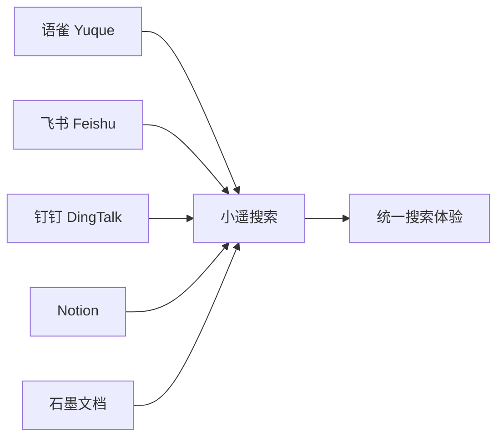
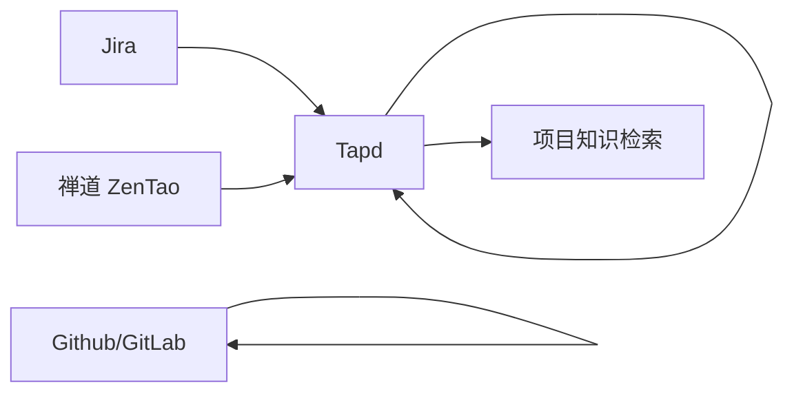
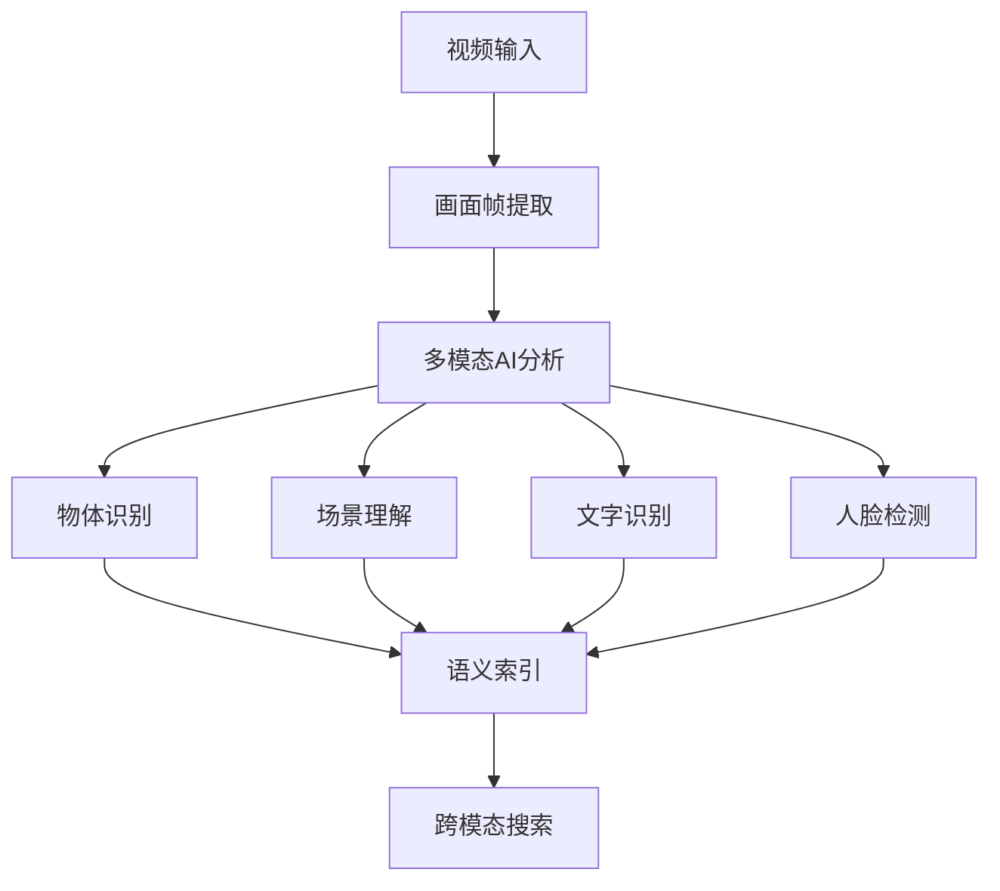
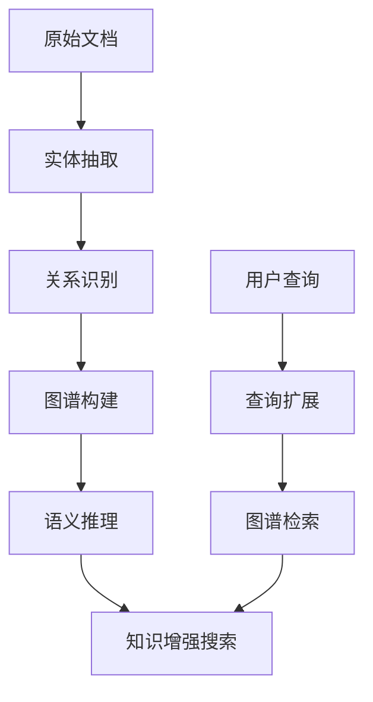
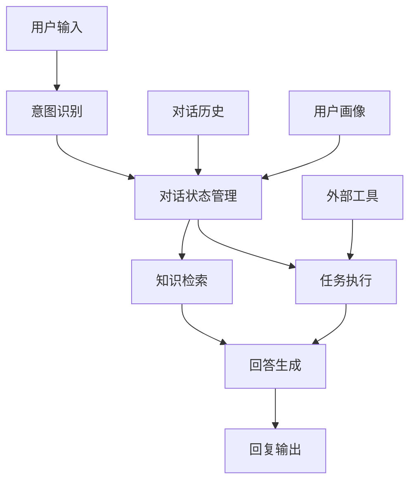
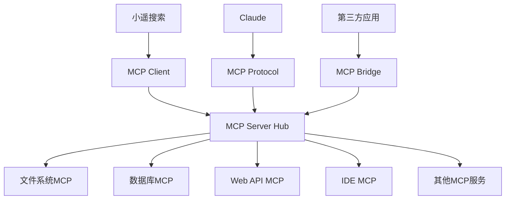

# 小遥搜索 XiaoyaoSearch - 产品路线图

> **当前版本**：v1.0
> **产品定位**：从本地AI搜索工具进化为智能知识工作平台
> 这份路线图展示了小遥搜索从本地搜索工具向智能知识工作平台演进的可能方向。具体的功能优先级和实施细节将根据用户反馈和技术发展进行调整。

## 📊 当前成就

### 核心能力
- **多模态AI搜索**：语音+文本+图像输入，本地AI处理
- **混合搜索引擎**：Faiss向量搜索 + Whoosh全文搜索
- **本地文件索引**：支持文档、音视频、图片等内容检索
- **AI模型集成**：BGE-M3文本嵌入 + FasterWhisper语音识别 + CN-CLIP图像理解 + Ollama LLM
- **桌面应用**：Electron + Vue3 跨平台支持

## 🚀 产品演进方向

### 1. 微内核架构演进

#### 当前架构限制
- 紧耦合的单体后端架构
- AI模型和服务硬编码集成
- 扩展新功能需要修改核心代码

#### 目标架构
```
┌─────────────────────────────────────────────────────────────────────┐
│                     插件化前端架构                                 │
│  ┌──────────────┐  ┌──────────────┐  ┌──────────────────┐        │
│  │ 搜索插件     │  │ 聊天插件     │  │ 数据源插件        │        │
│  │ - 多模态搜索  │  │ - AI对话     │  │ - 连接器管理      │        │
│  │ - 结果展示   │  │ - 上下文记忆 │  │ - API适配         │        │
│  └──────────────┘  └──────────────┘  └──────────────────┘        │
├─────────────────────────────────────────────────────────────────────┤
│                     微内核后端架构                                 │
│  ┌──────────────┐  ┌──────────────┐  ┌──────────────────┐        │
│  │ 核心引擎     │  │ 插件管理器   │  │ 服务注册中心       │        │
│  │ - 搜索抽象   │  │ - 生命周期   │  │ - 发现机制        │        │
│  │ - 存储抽象   │  │ - 依赖管理   │  │ - 配置管理        │        │
│  └──────────────┘  └──────────────┘  └──────────────────┘        │
├─────────────────────────────────────────────────────────────────────┤
│                     可插拔服务层                                   │
│  ┌──────────────┐  ┌──────────────┐  ┌──────────────────┐        │
│  │ AI服务插件   │  │ 存储服务插件 │  │ 外部集成插件      │        │
│  │ - 模型管理   │  │ - 数据库抽象 │  │ - 第三方API       │        │
│  │ - 推理引擎   │  │ - 缓存管理   │  │ - Webhook         │        │
│  └──────────────┘  └──────────────┘  └──────────────────┘        │
└─────────────────────────────────────────────────────────────────────┘
```

#### 技术要点
- **插件框架**：轻量级插件系统，支持热插拔
- **服务发现**：gRPC + 轻量级服务注册机制
- **配置管理**：支持热重载的分层配置系统
- **API网关**：统一的服务入口和路由管理

### 2. 多数据源扩展

#### 当前能力
仅支持本地文件系统索引和搜索

#### 扩展方向

**📝 文档协作平台**


**🛠️ 项目管理平台**


#### 数据连接器架构
- **统一接口**：标准化的数据源连接器接口
- **认证管理**：支持OAuth2.0、API Key等多种认证方式
- **同步策略**：实时同步、定时同步、按需同步
- **缓存机制**：智能缓存热门内容，减少API调用

#### 同步策略
- **实时同步**：Webhook + 增量更新
- **定时同步**：按需配置，支持差异同步
- **按需同步**：搜索时动态获取，缓存热门内容

### 3. 音频视频搜索增强

#### 当前限制
- 仅支持10分钟内音视频文件的字幕提取
- 缺乏画面内容理解和搜索
- 音频内容分析能力有限

#### 视频画面搜索升级

**技术方案**


#### 关键技术方向
- **SAM 2.0集成**：视频语义分割和对象跟踪
- **长视频处理**：水母平台（https://www.tiderhino.com/）集成，不限时长
- **多模态索引**：画面、音频、字幕的联合索引
- **智能分段**：基于内容变化的视频分段策略

#### 音频内容深度分析

**能力扩展**
- **声纹识别**：区分不同说话人
- **情感分析**：识别语音情绪和语调
- **音乐识别**：识别背景音乐和音效
- **静音检测**：智能跳过无声段落
- **关键信息提取**：自动提取会议要点和决策

### 4. RAG系统升级

#### 当前方案
固定500字符+50重叠的简单分块策略

#### 自适应分块算法

#### 分块策略矩阵
| 内容类型 | 分块策略 | 粒度 | 重叠 | 优化目标 |
|---------|---------|------|------|----------|
| 代码文件 | 函数/类级别 | 200-800行 | 0 | 语义完整性 |
| Markdown文档 | 章节/段落级别 | 300-600词 | 50 | 内容连贯性 |
| 技术文档 | 标题层级 | 按H1-H6结构 | 30-80 | 结构完整性 |
| 会议记录 | 主题切换 | 2-5分钟 | 10-20秒 | 对话连贯性 |
| 代码仓库 | 模块/包 | 文件组 | 文件间依赖 | 工程完整性 |

#### 知识图谱增强

**构建知识图谱**


#### 技术要点
- **实体识别**：集成BERT-NER等开源模型
- **关系抽取**：基于预训练模型的关系识别
- **图谱推理**：支持多跳推理和路径发现
- **可视化探索**：图谱的交互式浏览

#### 检索结果智能增强

**多维度结果增强**
- **查询意图理解**：分析用户真实意图
- **上下文信息补充**：基于历史行为补充上下文
- **相关性重排序**：多种算法融合的智能排序
- **答案生成和摘要**：直接生成简洁答案
- **相关问题推荐**：推荐相关问题和延伸阅读

### 5. 智能聊天助手

#### 功能定位
基于本地知识库的智能对话助手，支持：
- 多轮对话和上下文记忆
- 基于用户数据的个性化问答
- 任务型对话（帮助用户完成特定任务）
- 主动信息推荐和提醒

#### 对话管理架构



#### 核心能力

**对话理解**
- 意图识别和实体抽取
- 多轮对话上下文管理
- 情感分析和语气识别

**知识问答**
- 基于本地知识库的精确回答
- 多源信息的综合分析
- 答案的可信度评估

**任务执行**
- 文档整理和分类
- 信息汇总和报告生成
- 工作流程自动化

**个性化能力**
- 用户画像构建
- 智能推荐系统
- 自适应对话风格

### 6. MCP能力集成

#### MCP概述
Claude的Model Context Protocol允许AI应用安全地连接外部数据源和工具，实现更强大的智能能力。

#### MCP集成架构



#### 核心MCP服务

**文件系统增强MCP**
- 增强的文件列表，支持智能过滤和排序
- 智能文件内容读取，支持格式转换和预处理
- 跨文件内容搜索，集成小遥搜索能力
- 实时文件变更监控

**数据库访问MCP**
- 安全SQL执行，支持查询优化和结果格式化
- 数据库结构分析和建议
- 基于模板自动生成数据报告

**Web API集成MCP**
- 安全的API调用，支持认证和限流
- 第三方服务认证管理
- 数据同步和增量更新

#### Claude生态集成

**协作场景**
- **智能文档创作**：Claude写作 + 小遥搜索资料检索
- **代码开发辅助**：Claude编程 + 小遥搜索代码库检索
- **数据分析支持**：Claude分析 + 小遥搜索数据源连接
- **工作流程自动化**：Claude规划 + 小遥搜索执行检查

## 💡 技术决策要点

### 关键技术选型

#### 微内核架构
- **推荐**：自研轻量级插件系统
- **优势**：更好控制，符合项目特点，避免过度复杂

#### 视频AI处理
- **推荐**：水母平台 + 本地预处理
- **优势**：处理能力强，成本可控，技术风险低

#### 知识图谱
- **推荐**：Neo4j + 自研语义层
- **优势**：图数据库成熟，可视化好，生态完善

#### MCP集成
- **推荐**：积极参与Claude生态
- **优势**：生态红利明显，技术标准化

### 风险控制

#### 高风险项
- **视频处理成本**：智能预处理，分段处理，用户配额管理
- **第三方API限制**：多层缓存，增量同步，用户优先级管理
- **性能扩展性**：微服务架构，水平扩展，智能调度

#### 安全考虑
- **用户隐私安全**：端到端加密，权限隔离，审计日志
- **数据源安全**：OAuth2.0认证，访问令牌管理，权限控制
