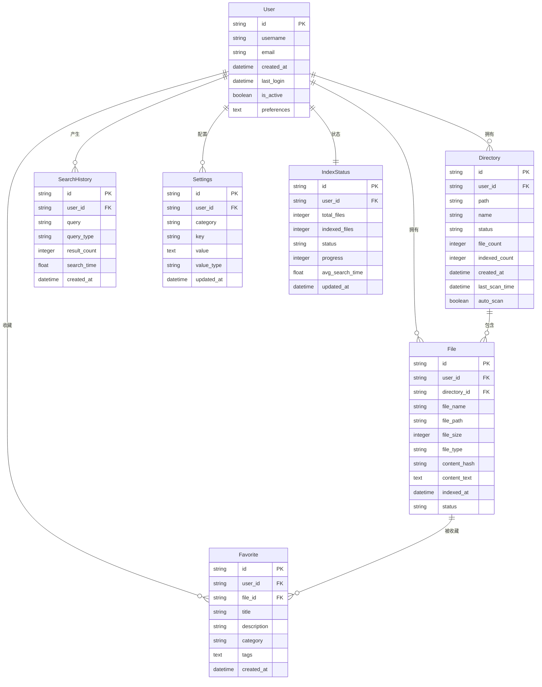

# 小遥搜索数据模型设计文档

## 概述

小遥搜索采用关系型数据库 SQLite 作为主要存储，结合 Faiss 向量索引和 Whoosh 全文索引，实现高效的混合搜索功能。数据模型设计遵循用户隔离、模块化和可扩展性原则。

**核心存储技术**：
- **SQLite**: 关系型数据存储，支持事务和 ACID 特性
- **Faiss**: 向量相似性搜索索引，用于语义搜索
- **Whoosh**: 全文搜索引擎，用于关键词搜索

## 数据库架构

### 存储结构
```
xiaoyao_search.db          # SQLite 主数据库
├── users                  # 用户表
├── directories            # 目录管理表
├── files                  # 文件索引表
├── search_history         # 搜索历史表
├── favorites              # 收藏表
├── settings               # 用户设置表
└── index_status           # 索引状态表

data/
├── vector_index/          # Faiss 向量索引
├── text_index/            # Whoosh 全文索引
└── document_mapping.json  # 文档映射关系
```

## 数据模型详细设计

### 1. 用户模型 (User)

用户管理的核心模型，支持多用户隔离。

**表结构**: `users`

| 字段名 | 类型 | 约束 | 说明 |
|--------|------|------|------|
| id | VARCHAR(36) | PRIMARY KEY | UUID 用户唯一标识 |
| username | VARCHAR(100) | NOT NULL | 用户名 |
| email | VARCHAR(255) | UNIQUE, INDEX | 邮箱地址（可选） |
| created_at | DATETIME | DEFAULT CURRENT_TIMESTAMP | 创建时间 |
| last_login | DATETIME | DEFAULT CURRENT_TIMESTAMP | 最后登录时间 |
| is_active | BOOLEAN | DEFAULT TRUE | 用户状态 |
| preferences | TEXT | NULL | JSON格式用户偏好 |

**关系映射**:
- `files` → 一对多 → 文件记录
- `directories` → 一对多 → 目录记录
- `search_histories` → 一对多 → 搜索历史
- `favorites` → 一对多 → 收藏记录
- `settings` → 一对多 → 用户设置

**SQLAlchemy 模型**:
```python
class User(Base):
    __tablename__ = "users"

    id = Column(String(36), primary_key=True, index=True)
    username = Column(String(100), nullable=False)
    email = Column(String(255), unique=True, index=True, nullable=True)
    created_at = Column(DateTime(timezone=True), server_default=func.now())
    last_login = Column(DateTime(timezone=True), server_default=func.now())
    is_active = Column(Boolean, default=True)
    preferences = Column(Text, nullable=True)  # JSON格式
```

### 2. 目录模型 (Directory)

管理用户索引的目录配置和状态。

**表结构**: `directories`

| 字段名 | 类型 | 约束 | 说明 |
|--------|------|------|------|
| id | VARCHAR(36) | PRIMARY KEY | UUID 目录唯一标识 |
| user_id | VARCHAR(36) | FOREIGN KEY → users.id | 所属用户 |
| path | VARCHAR(1000) | NOT NULL, UNIQUE | 目录绝对路径 |
| name | VARCHAR(255) | NOT NULL | 目录显示名称 |
| status | VARCHAR(20) | DEFAULT "active" | 目录状态 |
| file_count | INTEGER | DEFAULT 0 | 总文件数 |
| indexed_count | INTEGER | DEFAULT 0 | 已索引文件数 |
| error_count | INTEGER | DEFAULT 0 | 错误文件数 |
| created_at | DATETIME | DEFAULT CURRENT_TIMESTAMP | 创建时间 |
| updated_at | DATETIME | DEFAULT CURRENT_TIMESTAMP | 更新时间 |
| last_scan_time | DATETIME | NULL | 最后扫描时间 |
| is_scanning | BOOLEAN | DEFAULT FALSE | 是否正在扫描 |
| scan_progress | INTEGER | DEFAULT 0 | 扫描进度(0-100) |
| current_scan_file | VARCHAR(1000) | NULL | 当前扫描文件 |
| error_message | TEXT | NULL | 错误信息 |
| auto_scan | BOOLEAN | DEFAULT TRUE | 自动扫描开关 |
| scan_frequency | VARCHAR(20) | DEFAULT "realtime" | 扫描频率 |
| excluded_patterns | TEXT | NULL | 排除模式(JSON) |

**状态枚举**:
- `active`: 活跃状态，正常监控
- `inactive`: 非活跃状态，暂停监控
- `error`: 错误状态，存在配置问题

**扫描频率选项**:
- `realtime`: 实时监控文件变化
- `hourly`: 每小时扫描一次
- `daily`: 每天扫描一次
- `manual`: 手动触发扫描

**关系映射**:
- `user` → 多对一 → 用户记录
- `files` → 一对多 → 文件记录

### 3. 文件模型 (File)

文件索引的核心模型，存储文件元数据和索引状态。

**表结构**: `files`

| 字段名 | 类型 | 约束 | 说明 |
|--------|------|------|------|
| id | VARCHAR(36) | PRIMARY KEY | UUID 文件唯一标识 |
| user_id | VARCHAR(36) | FOREIGN KEY → users.id | 所属用户 |
| directory_id | VARCHAR(36) | FOREIGN KEY → directories.id | 所属目录 |
| file_name | VARCHAR(255) | NOT NULL | 文件名 |
| file_path | VARCHAR(1000) | NOT NULL, UNIQUE | 文件绝对路径 |
| file_size | INTEGER | NOT NULL | 文件大小(字节) |
| file_type | VARCHAR(50) | NOT NULL | 文件扩展名 |
| mime_type | VARCHAR(100) | NULL | MIME类型 |
| content_hash | VARCHAR(64) | NULL | SHA256内容哈希 |
| content_length | INTEGER | DEFAULT 0 | 提取文本长度 |
| content_text | TEXT | NULL | 提取的文本内容 |
| created_at | DATETIME | DEFAULT CURRENT_TIMESTAMP | 索引创建时间 |
| modified_at | DATETIME | NULL | 文件修改时间 |
| indexed_at | DATETIME | DEFAULT CURRENT_TIMESTAMP | 索引完成时间 |
| status | VARCHAR(20) | DEFAULT "pending" | 索引状态 |
| error_message | TEXT | NULL | 索引错误信息 |
| is_deleted | BOOLEAN | DEFAULT FALSE | 软删除标记 |
| last_accessed | DATETIME | NULL | 最后访问时间 |

**索引状态枚举**:
- `pending`: 等待索引
- `indexing`: 正在索引
- `indexed`: 索引完成
- `error`: 索引失败

**支持的文件类型**:
- 文档: PDF, DOCX, TXT, MD
- 演示: PPT, PPTX
- 表格: XLS, XLSX, CSV
- 图片: JPG, PNG, GIF (通过OCR提取文本)
- 代码: PY, JS, TS, JAVA, CPP, HTML, CSS

**关系映射**:
- `user` → 多对一 → 用户记录
- `directory` → 多对一 → 目录记录

### 4. 搜索历史模型 (SearchHistory)

记录用户的搜索行为，用于优化搜索体验。

**表结构**: `search_history`

| 字段名 | 类型 | 约束 | 说明 |
|--------|------|------|------|
| id | VARCHAR(36) | PRIMARY KEY | UUID 历史记录唯一标识 |
| user_id | VARCHAR(36) | FOREIGN KEY → users.id | 所属用户 |
| query | VARCHAR(1000) | NOT NULL | 搜索查询内容 |
| query_type | VARCHAR(20) | DEFAULT "text" | 查询类型 |
| filters | TEXT | NULL | 过滤条件(JSON) |
| result_count | INTEGER | DEFAULT 0 | 搜索结果数 |
| search_time | FLOAT | NULL | 搜索耗时(秒) |
| clicked_result_id | VARCHAR(36) | NULL | 点击结果ID |
| query_understanding | TEXT | NULL | AI查询理解(JSON) |
| suggestions | TEXT | NULL | 搜索建议(JSON) |
| created_at | DATETIME | DEFAULT CURRENT_TIMESTAMP | 搜索时间 |
| session_id | VARCHAR(36) | NULL | 会话ID |
| user_agent | VARCHAR(500) | NULL | 用户代理信息 |

**查询类型枚举**:
- `text`: 文本查询
- `voice`: 语音查询（转文本后存储）
- `image`: 图像查询（识别后存储）

**AI处理信息**:
- `query_understanding`: 存储AI对用户查询的理解结果，包括关键词、时间范围、文件类型等
- `suggestions`: 智能搜索建议，帮助用户优化查询

### 5. 收藏模型 (Favorite)

用户收藏的文件，支持分类和标签管理。

**表结构**: `favorites`

| 字段名 | 类型 | 约束 | 说明 |
|--------|------|------|------|
| id | VARCHAR(36) | PRIMARY KEY | UUID 收藏记录唯一标识 |
| user_id | VARCHAR(36) | FOREIGN KEY → users.id | 所属用户 |
| file_id | VARCHAR(36) | FOREIGN KEY → files.id | 收藏的文件 |
| title | VARCHAR(500) | NULL | 用户自定义标题 |
| description | TEXT | NULL | 收藏描述 |
| category | VARCHAR(100) | NULL | 收藏分类 |
| tags | TEXT | NULL | 标签列表(JSON) |
| created_at | DATETIME | DEFAULT CURRENT_TIMESTAMP | 收藏时间 |
| accessed_at | DATETIME | DEFAULT CURRENT_TIMESTAMP | 最后访问时间 |

**标签结构**:
```json
{
  "tags": ["项目文档", "重要", "Q4-2024"],
  "priority": "high",
  "custom_fields": {
    "project": "xiaoyao-search",
    "deadline": "2024-12-31"
  }
}
```

**关系映射**:
- `user` → 多对一 → 用户记录
- `file` → 多对一 → 文件记录

### 6. 设置模型 (Settings)

用户配置信息，支持分类管理。

**表结构**: `settings`

| 字段名 | 类型 | 约束 | 说明 |
|--------|------|------|------|
| id | VARCHAR(36) | PRIMARY KEY | UUID 设置记录唯一标识 |
| user_id | VARCHAR(36) | FOREIGN KEY → users.id | 所属用户 |
| category | VARCHAR(50) | NOT NULL | 设置分类 |
| key | VARCHAR(100) | NOT NULL | 设置键 |
| value | TEXT | NULL | 设置值 |
| value_type | VARCHAR(20) | NOT NULL | 值类型 |
| default_value | TEXT | NULL | 默认值 |
| description | TEXT | NULL | 设置说明 |
| is_sensitive | VARCHAR(10) | DEFAULT "false" | 敏感信息标记 |
| created_at | DATETIME | DEFAULT CURRENT_TIMESTAMP | 创建时间 |
| updated_at | DATETIME | DEFAULT CURRENT_TIMESTAMP | 更新时间 |

**设置分类**:
- `search`: 搜索相关设置
- `index`: 索引相关设置
- `ai`: AI功能设置
- `ui`: 界面设置
- `performance`: 性能设置

**值类型枚举**:
- `string`: 字符串
- `integer`: 整数
- `boolean`: 布尔值
- `json`: JSON对象

**复合唯一约束**:
`(user_id, category, key)` - 确保每个用户的设置项唯一

### 7. 索引状态模型 (IndexStatus)

跟踪索引系统状态和性能指标。

**表结构**: `index_status`

| 字段名 | 类型 | 约束 | 说明 |
|--------|------|------|------|
| id | VARCHAR(36) | PRIMARY KEY | UUID 状态记录唯一标识 |
| user_id | VARCHAR(36) | FOREIGN KEY → users.id | 所属用户 |
| total_files | INTEGER | DEFAULT 0 | 总文件数 |
| indexed_files | INTEGER | DEFAULT 0 | 已索引文件数 |
| total_size | INTEGER | DEFAULT 0 | 总大小(字节) |
| status | VARCHAR(20) | DEFAULT "idle" | 索引状态 |
| progress | INTEGER | DEFAULT 0 | 进度(0-100) |
| current_task | VARCHAR(500) | NULL | 当前任务 |
| vector_index_version | INTEGER | DEFAULT 1 | 向量索引版本 |
| text_index_version | INTEGER | DEFAULT 1 | 文本索引版本 |
| avg_search_time | FLOAT | DEFAULT 0.0 | 平均搜索时间(秒) |
| last_index_time | DATETIME | NULL | 最后索引时间 |
| created_at | DATETIME | DEFAULT CURRENT_TIMESTAMP | 创建时间 |
| updated_at | DATETIME | DEFAULT CURRENT_TIMESTAMP | 更新时间 |

**索引状态枚举**:
- `idle`: 空闲状态
- `indexing`: 正在索引
- `optimizing`: 正在优化
- `error`: 错误状态

## 索引系统设计

### 向量索引 (Faiss)
```python
# Faiss 索引配置
index_dimension = 768  # 嵌入向量维度
index_type = "IndexFlatIP"  # 内积相似度
metric_type = "METRIC_INNER_PRODUCT"
```

**存储结构**:
- `vector_index/faiss.index`: Faiss 向量索引文件
- `vector_index/id_map.npy`: 向量ID映射数组
- `vector_index/metadata.json`: 索引元数据

### 全文索引 (Whoosh)
```python
# Whoosh 索引字段
schema = {
    "content": TEXT(stored=True, analyzer=StemmingAnalyzer()),
    "title": TEXT(stored=True),
    "file_path": ID(stored=True),
    "file_type": ID(stored=True),
    "doc_id": ID(stored=True, unique=True)
}
```

**存储结构**:
- `text_index/MAIN_*.toc`: Whoosh 主索引文件
- `text_index/_*.seg*: 段文件

### 文档映射
```json
{
  "doc_123": {
    "file_path": "/path/to/document.pdf",
    "file_type": "pdf",
    "title": "文档标题",
    "indexed_at": "2024-11-10T10:30:00Z",
    "file_size": 1048576,
    "vector_id": 0,
    "text_index_id": "doc_123"
  }
}
```

## 数据关系图



## 数据完整性约束

### 外键约束
- 所有表的 `user_id` 必须引用 `users.id`
- `files.directory_id` 引用 `directories.id`
- `favorites.file_id` 引用 `files.id`

### 唯一性约束
- `users.email`: 邮箱地址唯一
- `files.file_path`: 文件路径唯一
- `directories.path`: 目录路径唯一
- `settings`: 复合唯一 `(user_id, category, key)`

### 索引策略
```sql
-- 用户表索引
CREATE INDEX idx_users_email ON users(email);
CREATE INDEX idx_users_active ON users(is_active);

-- 文件表索引
CREATE INDEX idx_files_user_path ON files(user_id, file_path);
CREATE INDEX idx_files_type ON files(file_type);
CREATE INDEX idx_files_status ON files(status);
CREATE INDEX idx_files_indexed ON files(indexed_at);

-- 目录表索引
CREATE INDEX idx_directories_user ON directories(user_id);
CREATE INDEX idx_directories_status ON directories(status);

-- 搜索历史索引
CREATE INDEX idx_search_history_user ON search_history(user_id);
CREATE INDEX idx_search_history_created ON search_history(created_at);

-- 收藏表索引
CREATE INDEX idx_favorites_user ON favorites(user_id);
CREATE INDEX idx_favorites_file ON favorites(file_id);
CREATE INDEX idx_favorites_category ON favorites(category);

-- 设置表索引
CREATE INDEX idx_settings_user_category ON settings(user_id, category);
CREATE INDEX idx_settings_key ON settings(key);
```

## 默认数据

### 默认用户设置
```json
{
  "search": {
    "search_mode": "hybrid",
    "results_per_page": 20,
    "auto_suggestions": true,
    "search_history_enabled": true
  },
  "index": {
    "index_update_frequency": "realtime",
    "max_file_size": 104857600,
    "supported_file_types": [".pdf", ".docx", ".txt", ".md"]
  },
  "ai": {
    "ai_mode": "local",
    "gpu_acceleration": true,
    "embedding_model": "sentence-transformers/paraphrase-multilingual-MiniLM-L12-v2"
  },
  "ui": {
    "theme": "light",
    "language": "zh-CN",
    "font_size": 14
  },
  "performance": {
    "max_memory_usage": 2048,
    "max_concurrent_tasks": 4,
    "cache_size": 512
  }
}
```

### 默认索引状态
```json
{
  "status": "idle",
  "progress": 0,
  "total_files": 0,
  "indexed_files": 0,
  "vector_index_version": 1,
  "text_index_version": 1,
  "avg_search_time": 0.0
}
```

## 数据库连接池管理

### 连接池配置
小遥搜索实现了智能的数据库连接池管理，支持多种数据库类型：

#### SQLite 连接池
```python
# SQLite特定配置
engine_kwargs = {
    "connect_args": {
        "check_same_thread": False,
        "timeout": 30,  # 连接超时
        "isolation_level": "IMMEDIATE",  # 事务隔离级别
    },
    "poolclass": StaticPool,  # 静态连接池
    "pool_pre_ping": True,  # 连接健康检查
}
```

#### 其他数据库连接池
```python
# PostgreSQL/MySQL等连接池配置
engine_kwargs = {
    "poolclass": QueuePool,
    "pool_size": 10,  # 连接池大小
    "max_overflow": 20,  # 最大溢出连接数
    "pool_timeout": 30,  # 获取连接超时
    "pool_recycle": 3600,  # 连接回收时间
    "pool_pre_ping": True,  # 连接健康检查
}
```

### SQLite 性能优化
通过事件监听器自动优化SQLite性能：
```sql
-- 启用WAL模式提高并发性能
PRAGMA journal_mode=WAL;

-- 启用外键约束
PRAGMA foreign_keys=ON;

-- 优化SQLite性能
PRAGMA synchronous=NORMAL;
PRAGMA cache_size=10000;
PRAGMA temp_store=MEMORY;
PRAGMA mmap_size=268435456;  -- 256MB内存映射
```

### 连接监控
- **连接检出/检入日志**: 自动记录数据库连接的获取和释放
- **连接健康检查**: 使用 `pool_pre_ping` 自动检测连接有效性
- **连接状态统计**: 实时监控连接池的使用情况

## 数据库备份与恢复

### 自动备份机制
实现了完整的数据库备份和恢复功能，支持数据安全保障：

#### 备份策略
- **时间戳命名**: 备份文件包含创建时间戳，避免覆盖
- **目录管理**: 自动创建备份目录，支持自定义备份路径
- **文件验证**: 备份完成后验证备份文件完整性

#### 备份实现
```python
def backup_database(backup_dir: Optional[str] = None) -> str:
    """创建数据库备份"""
    # 生成备份文件名
    timestamp = datetime.now().strftime("%Y%m%d_%H%M%S")
    backup_filename = f"{db_filename}.backup_{timestamp}"

    # 执行备份
    shutil.copy2(db_path, backup_path)

    return backup_path
```

#### 安全恢复机制
```python
def restore_database(backup_path: str) -> None:
    """安全恢复数据库"""
    # 1. 验证备份文件存在
    # 2. 创建当前数据库备份（防止恢复失败）
    # 3. 执行恢复操作
    # 4. 失败时自动回滚
```

### 备份管理功能
- **备份列表**: 按时间排序显示所有备份文件
- **备份统计**: 显示备份文件大小、创建时间等信息
- **自动清理**: 支持保留指定数量的最新备份，自动清理旧备份
- **批量管理**: 支持批量备份和恢复操作

### CLI 管理工具
提供了完整的命令行管理接口：
```bash
# 数据库健康检查
python database_cli.py health

# 创建备份
python database_cli.py backup

# 列出备份
python database_cli.py list

# 恢复数据库
python database_cli.py restore /path/to/backup.db

# 清理旧备份
python database_cli.py cleanup --keep 5
```

### API 管理接口
完整的RESTful API支持远程数据库管理：
- `GET /database/health` - 数据库健康检查
- `POST /database/backup` - 创建数据库备份
- `GET /database/backups` - 列出备份文件
- `POST /database/restore` - 恢复数据库
- `DELETE /database/backups/cleanup` - 清理旧备份

## 性能优化策略

### 1. 数据库优化
- **连接池**: 使用 SQLAlchemy 连接池管理连接，支持自动健康检查
- **批量操作**: 批量插入和更新减少数据库I/O
- **索引优化**: 根据查询模式优化索引策略
- **连接监控**: 实时监控连接池状态和性能指标

### 2. 索引优化
- **增量更新**: 支持增量索引更新，避免全量重建
- **分片策略**: 大规模数据时支持索引分片
- **缓存机制**: 搜索结果缓存提高响应速度

### 3. 存储优化
- **压缩存储**: 文本内容使用压缩存储
- **分区策略**: 按时间和用户分区存储历史数据
- **清理机制**: 自动清理过期数据

## 数据迁移和版本控制

使用 Alembic 进行数据库版本控制和迁移：

```bash
# 创建迁移
alembic revision --autogenerate -m "描述变更"

# 执行迁移
alembic upgrade head

# 回滚迁移
alembic downgrade -1
```

### 备份策略
```bash
# 数据库备份
sqlite3 xiaoyao_search.db ".backup backup_$(date +%Y%m%d).db"

# 索引备份
tar -czf data_backup_$(date +%Y%m%d).tar.gz data/
```

## 安全考虑

### 数据隐私
- **用户隔离**: 严格的多租户数据隔离
- **敏感数据**: 设置敏感标记，加密存储
- **访问控制**: 基于用户权限的访问控制

### 数据完整性
- **事务支持**: 关键操作使用事务保证一致性
- **外键约束**: 数据引用完整性检查
- **软删除**: 重要数据软删除，支持恢复

## 监控和维护

### 性能监控
- **查询性能**: 跟踪平均搜索时间
- **索引状态**: 监控索引健康状态
- **存储使用**: 监控磁盘空间使用

### 维护任务
- **索引重建**: 定期重建优化索引
- **数据清理**: 清理过期历史数据
- **统计更新**: 更新数据库统计信息

---

此数据模型设计为小遥搜索提供了强大的数据基础，支持高效的混合搜索、用户隔离、可扩展架构和丰富的功能特性。