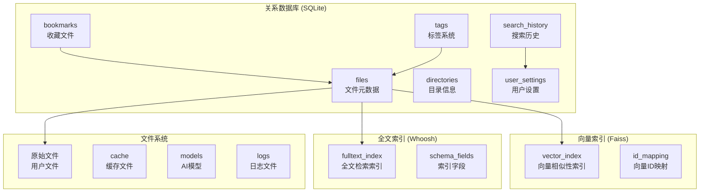

# 小遥搜索数据模型设计

## 概述

小遥搜索的数据模型采用混合存储架构，结合关系型数据库、向量索引和全文索引，支持高效的语义搜索和传统关键词搜索。数据模型设计遵循隐私保护原则，所有数据存储在用户本地。

## 整体数据架构



## SQLite 数据库表结构

### 1. files 表 - 文件元数据

```sql
CREATE TABLE files (
    id INTEGER PRIMARY KEY AUTOINCREMENT,
    file_path TEXT NOT NULL UNIQUE,           -- 文件绝对路径
    file_name TEXT NOT NULL,                  -- 文件名
    file_extension TEXT NOT NULL,             -- 文件扩展名
    file_size INTEGER NOT NULL,               -- 文件大小 (字节)
    file_hash TEXT NOT NULL,                  -- MD5哈希值
    mime_type TEXT,                           -- MIME类型
    content_type TEXT NOT NULL,               -- 内容类型: document/image/audio/video

    -- 索引相关字段
    vector_id INTEGER,                        -- Faiss向量索引ID
    is_indexed BOOLEAN NOT NULL DEFAULT FALSE, -- 是否已索引
    index_status TEXT DEFAULT 'pending',      -- 索引状态: pending/indexing/failed/completed
    index_error TEXT,                         -- 索引错误信息
    last_indexed_at DATETIME,                 -- 最后索引时间

    -- 内容相关字段
    content_text TEXT,                        -- 提取的文本内容
    content_summary TEXT,                     -- AI生成的摘要
    content_tags TEXT,                        -- JSON格式的标签
    ocr_text TEXT,                            -- OCR提取的文本
    transcription_text TEXT,                  -- 音频转录文本

    -- 时间戳
    created_at DATETIME NOT NULL DEFAULT CURRENT_TIMESTAMP,
    updated_at DATETIME NOT NULL DEFAULT CURRENT_TIMESTAMP,
    file_created_at DATETIME,                 -- 文件创建时间
    file_modified_at DATETIME,                -- 文件修改时间

    -- 搜索相关
    search_count INTEGER DEFAULT 0,           -- 搜索次数
    last_accessed_at DATETIME,                -- 最后访问时间

    -- 文件元数据
    metadata TEXT,                            -- JSON格式的额外元数据

    -- 外键
    directory_id INTEGER,                     -- 所属目录ID
    parent_id INTEGER,                        -- 父文件ID (用于附件等)

    FOREIGN KEY (directory_id) REFERENCES directories(id),
    FOREIGN KEY (parent_id) REFERENCES files(id)
);

-- 索引优化
CREATE INDEX idx_files_path ON files(file_path);
CREATE INDEX idx_files_hash ON files(file_hash);
CREATE INDEX idx_files_type ON files(content_type);
CREATE INDEX idx_files_extension ON files(file_extension);
CREATE INDEX idx_files_indexed ON files(is_indexed);
CREATE INDEX idx_files_modified ON files(file_modified_at);
CREATE INDEX idx_files_directory ON files(directory_id);
CREATE INDEX idx_files_search_count ON files(search_count DESC);
```

### 2. directories 表 - 目录信息

```sql
CREATE TABLE directories (
    id INTEGER PRIMARY KEY AUTOINCREMENT,
    directory_path TEXT NOT NULL UNIQUE,     -- 目录绝对路径
    directory_name TEXT NOT NULL,             -- 目录名
    parent_id INTEGER,                        -- 父目录ID

    -- 索引相关
    is_watched BOOLEAN NOT NULL DEFAULT FALSE, -- 是否监控变化
    is_indexed BOOLEAN NOT NULL DEFAULT FALSE, -- 是否已索引
    watch_recursive BOOLEAN DEFAULT TRUE,     -- 是否递归监控

    -- 统计信息
    file_count INTEGER DEFAULT 0,             -- 文件数量
    total_size INTEGER DEFAULT 0,             -- 总大小
    indexed_count INTEGER DEFAULT 0,          -- 已索引文件数

    -- 配置
    file_types TEXT,                          -- JSON: 允许的文件类型
    exclude_patterns TEXT,                    -- JSON: 排除模式

    -- 时间戳
    created_at DATETIME NOT NULL DEFAULT CURRENT_TIMESTAMP,
    updated_at DATETIME NOT NULL DEFAULT CURRENT_TIMESTAMP,
    last_scanned_at DATETIME,                 -- 最后扫描时间

    FOREIGN KEY (parent_id) REFERENCES directories(id)
);

-- 索引
CREATE INDEX idx_directories_path ON directories(directory_path);
CREATE INDEX idx_directories_watched ON directories(is_watched);
CREATE INDEX idx_directories_parent ON directories(parent_id);
```

### 3. search_history 表 - 搜索历史

```sql
CREATE TABLE search_history (
    id INTEGER PRIMARY KEY AUTOINCREMENT,
    query_text TEXT NOT NULL,                 -- 搜索查询
    query_type TEXT DEFAULT 'text',           -- 查询类型: text/voice/image
    query_embedding BLOB,                     -- 查询向量 (可选)

    -- 搜索结果统计
    result_count INTEGER DEFAULT 0,           -- 结果数量
    top_result_id INTEGER,                    -- 最佳结果文件ID

    -- 搜索参数
    filters TEXT,                             -- JSON: 搜索过滤器
    sort_by TEXT DEFAULT 'relevance',         -- 排序方式
    search_mode TEXT DEFAULT 'hybrid',        -- 搜索模式: hybrid/vector/fulltext

    -- AI查询分析
    parsed_keywords TEXT,                     -- JSON: 解析的关键词
    semantic_query TEXT,                      -- 语义化查询
    intent_type TEXT,                         -- 意图类型
    time_range TEXT,                          -- JSON: 时间范围

    -- 性能指标
    search_duration REAL,                     -- 搜索耗时 (秒)

    -- 时间戳
    created_at DATETIME NOT NULL DEFAULT CURRENT_TIMESTAMP,

    FOREIGN KEY (top_result_id) REFERENCES files(id)
);

-- 索引
CREATE INDEX idx_search_history_query ON search_history(query_text);
CREATE INDEX idx_search_history_type ON search_history(query_type);
CREATE INDEX idx_search_history_created ON search_history(created_at DESC);
```

### 4. user_settings 表 - 用户设置

```sql
CREATE TABLE user_settings (
    id INTEGER PRIMARY KEY AUTOINCREMENT,
    setting_key TEXT NOT NULL UNIQUE,
    setting_value TEXT NOT NULL,
    setting_type TEXT DEFAULT 'string',       -- string/integer/boolean/json
    category TEXT NOT NULL,                   -- search/index/ui/ai/security

    -- 设置描述
    description TEXT,

    -- 时间戳
    created_at DATETIME NOT NULL DEFAULT CURRENT_TIMESTAMP,
    updated_at DATETIME NOT NULL DEFAULT CURRENT_TIMESTAMP
);

-- 索引
CREATE INDEX idx_user_settings_key ON user_settings(setting_key);
CREATE INDEX idx_user_settings_category ON user_settings(category);
```

### 5. tags 表 - 标签系统

```sql
CREATE TABLE tags (
    id INTEGER PRIMARY KEY AUTOINCREMENT,
    tag_name TEXT NOT NULL UNIQUE,
    tag_color TEXT DEFAULT '#1890ff',         -- 标签颜色
    tag_icon TEXT,                            -- 标签图标
    description TEXT,                         -- 标签描述

    -- 统计
    usage_count INTEGER DEFAULT 0,            -- 使用次数

    -- 时间戳
    created_at DATETIME NOT NULL DEFAULT CURRENT_TIMESTAMP,
    updated_at DATETIME NOT NULL DEFAULT CURRENT_TIMESTAMP
);

-- 文件标签关联表
CREATE TABLE file_tags (
    file_id INTEGER NOT NULL,
    tag_id INTEGER NOT NULL,

    -- 关联属性
    confidence REAL DEFAULT 1.0,             -- 置信度 (AI生成的标签)
    source TEXT DEFAULT 'manual',             -- 标签来源: manual/ai/user

    -- 时间戳
    created_at DATETIME NOT NULL DEFAULT CURRENT_TIMESTAMP,

    PRIMARY KEY (file_id, tag_id),
    FOREIGN KEY (file_id) REFERENCES files(id) ON DELETE CASCADE,
    FOREIGN KEY (tag_id) REFERENCES tags(id) ON DELETE CASCADE
);

-- 索引
CREATE INDEX idx_tags_name ON tags(tag_name);
CREATE INDEX idx_file_tags_file ON file_tags(file_id);
CREATE INDEX idx_file_tags_tag ON file_tags(tag_id);
```

### 6. bookmarks 表 - 收藏文件

```sql
CREATE TABLE bookmarks (
    id INTEGER PRIMARY KEY AUTOINCREMENT,
    file_id INTEGER NOT NULL,

    -- 收藏信息
    folder_path TEXT DEFAULT '/',              -- 收藏夹路径
    notes TEXT,                               -- 用户备注
    rating INTEGER DEFAULT 0,                 -- 评分 1-5

    -- 收藏来源
    source TEXT DEFAULT 'manual',             -- manual/search/auto

    -- 时间戳
    created_at DATETIME NOT NULL DEFAULT CURRENT_TIMESTAMP,
    updated_at DATETIME NOT NULL DEFAULT CURRENT_TIMESTAMP,

    FOREIGN KEY (file_id) REFERENCES files(id) ON DELETE CASCADE,
    UNIQUE(file_id) -- 每个文件只能收藏一次
);

-- 索引
CREATE INDEX idx_bookmarks_file ON bookmarks(file_id);
CREATE INDEX idx_bookmarks_folder ON bookmarks(folder_path);
CREATE INDEX idx_bookmarks_created ON bookmarks(created_at DESC);
```

### 7. search_cache 表 - 搜索缓存

```sql
CREATE TABLE search_cache (
    id INTEGER PRIMARY KEY AUTOINCREMENT,
    cache_key TEXT NOT NULL UNIQUE,           -- 缓存键 (查询哈希)

    -- 缓存内容
    query_text TEXT NOT NULL,                 -- 原始查询
    result_ids TEXT NOT NULL,                 -- JSON: 文件ID列表
    result_scores TEXT,                       -- JSON: 相关度分数
    total_count INTEGER DEFAULT 0,            -- 总结果数

    -- 缓存统计
    hit_count INTEGER DEFAULT 0,              -- 命中次数
    is_valid BOOLEAN DEFAULT TRUE,            -- 是否有效

    -- 时间戳
    created_at DATETIME NOT NULL DEFAULT CURRENT_TIMESTAMP,
    expires_at DATETIME NOT NULL,             -- 过期时间
    last_hit_at DATETIME                      -- 最后命中时间
);

-- 索引
CREATE INDEX idx_search_cache_key ON search_cache(cache_key);
CREATE INDEX idx_search_cache_expires ON search_cache(expires_at);
CREATE INDEX idx_search_cache_hit_count ON search_cache(hit_count DESC);
```

### 8. index_queue 表 - 索引任务队列

```sql
CREATE TABLE index_queue (
    id INTEGER PRIMARY KEY AUTOINCREMENT,
    file_id INTEGER NOT NULL,

    -- 任务信息
    task_type TEXT NOT NULL,                  -- create/update/delete
    priority INTEGER DEFAULT 0,               -- 优先级 (数字越大优先级越高)
    status TEXT DEFAULT 'pending',            -- pending/processing/completed/failed

    -- 任务元数据
    retry_count INTEGER DEFAULT 0,            -- 重试次数
    error_message TEXT,                       -- 错误信息

    -- 时间戳
    created_at DATETIME NOT NULL DEFAULT CURRENT_TIMESTAMP,
    started_at DATETIME,                      -- 开始处理时间
    completed_at DATETIME,                    -- 完成时间

    FOREIGN KEY (file_id) REFERENCES files(id) ON DELETE CASCADE
);

-- 索引
CREATE INDEX idx_index_queue_status ON index_queue(status);
CREATE INDEX idx_index_queue_priority ON index_queue(priority DESC);
CREATE INDEX idx_index_queue_created ON index_queue(created_at);
```

### 9. system_logs 表 - 系统日志

```sql
CREATE TABLE system_logs (
    id INTEGER PRIMARY KEY AUTOINCREMENT,

    -- 日志信息
    level TEXT NOT NULL,                      -- DEBUG/INFO/WARNING/ERROR/CRITICAL
    category TEXT NOT NULL,                   -- SEARCH/INDEX/AI/UI/SYSTEM
    message TEXT NOT NULL,                    -- 日志消息
    details TEXT,                             -- JSON: 详细信息

    -- 关联信息
    user_id INTEGER,                          -- 用户ID (未来扩展)
    file_id INTEGER,                          -- 相关文件ID
    session_id TEXT,                          -- 会话ID

    -- 性能指标
    duration REAL,                            -- 操作耗时
    memory_usage INTEGER,                     -- 内存使用

    -- 时间戳
    created_at DATETIME NOT NULL DEFAULT CURRENT_TIMESTAMP,

    FOREIGN KEY (file_id) REFERENCES files(id)
);

-- 索引
CREATE INDEX idx_system_logs_level ON system_logs(level);
CREATE INDEX idx_system_logs_category ON system_logs(category);
CREATE INDEX idx_system_logs_created ON system_logs(created_at DESC);
CREATE INDEX idx_system_logs_file ON system_logs(file_id);
```

## 向量索引模型

### Faiss 向量索引结构

```python
# 向量索引结构设计
class VectorIndexSchema:
    """向量索引架构定义"""

    # 索引配置
    DIMENSION = 768  # BGE模型向量维度
    INDEX_TYPE = "IndexIVFFlat"  # 索引类型
    NLIST = 100  # 聚类中心数量
    NPROBE = 10  # 搜索时的探测数量

    # 向量元数据
    METADATA_FIELDS = {
        'file_id': 'int',      # 文件ID
        'chunk_index': 'int',  # 文本块索引
        'chunk_type': 'str',   # 块类型: title/content/ocr/transcription
        'model_version': 'str' # 模型版本
    }

    # 文本分块策略
    CHUNK_SIZE = 512  # 文本块大小
    CHUNK_OVERLAP = 100  # 重叠大小
    MAX_CHUNKS_PER_FILE = 100  # 每个文件最大块数
```

### ID映射文件结构

```json
{
  "version": "1.0",
  "created_at": "2024-01-01T00:00:00Z",
  "total_vectors": 150000,
  "file_mapping": {
    "123": {
      "file_id": 123,
      "vector_ids": [1000, 1001, 1002],
      "chunks": [
        {
          "vector_id": 1000,
          "chunk_index": 0,
          "chunk_type": "title",
          "text": "小遥搜索产品需求文档",
          "start_pos": 0,
          "end_pos": 20
        }
      ]
    }
  },
  "model_info": {
    "name": "bge-base-zh",
    "dimension": 768,
    "version": "1.0"
  }
}
```

## 全文索引模型

### Whoosh 索引Schema

```python
from whoosh.fields import Schema, TEXT, ID, KEYWORD, NUMERIC, DATETIME
from jieba.analyse import ChineseAnalyzer

# 全文索引Schema定义
SEARCH_SCHEMA = Schema(
    # 基础字段
    file_id=ID(stored=True, unique=True),              # 文件ID
    file_path=ID(stored=True),                         # 文件路径
    file_name=TEXT(stored=True, analyzer=ChineseAnalyzer()),  # 文件名
    content_type=KEYWORD(stored=True),                 # 内容类型

    # 内容字段
    title=TEXT(analyzer=ChineseAnalyzer(), phrase=True),        # 标题
    content=TEXT(analyzer=ChineseAnalyzer(), phrase=True),      # 主要内容
    ocr_text=TEXT(analyzer=ChineseAnalyzer(), phrase=True),    # OCR文本
    transcription=TEXT(analyzer=ChineseAnalyzer(), phrase=True), # 转录文本

    # 元数据字段
    file_extension=KEYWORD(stored=True),                # 文件扩展名
    file_size=NUMERIC(stored=True),                    # 文件大小
    file_modified=DATETIME(stored=True),               # 修改时间

    # 标签字段
    tags=KEYWORD(stored=True, commas=True),            # 标签

    # 统计字段
    search_count=NUMERIC(stored=True),                 # 搜索次数

    # 文件预览
    preview=TEXT(stored=True)                          # 内容预览
)
```

## 缓存模型

### 内存缓存结构

```python
# 本地缓存键命名规范
CACHE_KEYS = {
    'search_result': 'search:result:{query_hash}',
    'file_content': 'file:content:{file_id}',
    'ai_analysis': 'ai:analysis:{file_id}',
    'user_session': 'session:{session_id}',
    'model_cache': 'model:{model_name}:cache'
}

# 缓存过期时间 (秒)
CACHE_TTL = {
    'search_result': 300,      # 5分钟
    'file_content': 3600,      # 1小时
    'ai_analysis': 7200,       # 2小时
    'user_session': 86400,     # 24小时
    'model_cache': 604800      # 7天
}

# 使用Python内置字典和LRU缓存
import functools
from typing import Dict, Any, Optional
import time
import hashlib

class LocalCache:
    def __init__(self, max_size: int = 1000):
        self.cache: Dict[str, Dict[str, Any]] = {}
        self.max_size = max_size

    def get(self, key: str) -> Optional[Any]:
        if key in self.cache:
            item = self.cache[key]
            if time.time() < item['expires_at']:
                item['access_count'] += 1
                return item['value']
            else:
                del self.cache[key]
        return None

    def set(self, key: str, value: Any, ttl: int = 300):
        # 简单的LRU实现
        if len(self.cache) >= self.max_size:
            # 删除最少使用的项
            least_used = min(self.cache.items(), key=lambda x: x[1]['access_count'])
            del self.cache[least_used[0]]

        self.cache[key] = {
            'value': value,
            'expires_at': time.time() + ttl,
            'access_count': 1,
            'created_at': time.time()
        }

# 全局缓存实例
cache = LocalCache(max_size=1000)
```

### 文件系统缓存结构

```
~/.ai-search/cache/
├── embeddings/               # 向量嵌入缓存
│   ├── file_123.json         # 文件嵌入向量
│   └── query_hash.json       # 查询嵌入向量
├── transcriptions/           # 音频转录缓存
│   ├── audio_123.txt         # 音频转录结果
│   └── video_456.txt         # 视频音频转录结果
├── previews/                 # 文件预览缓存
│   ├── pdf_123.pdf           # PDF预览
│   ├── image_456.jpg         # 图片缩略图
│   └── video_789.mp4         # 视频预览片段
├── ocr/                      # OCR结果缓存
│   ├── image_123.json        # 图片OCR结果
│   └── document_456.json     # 文档OCR结果
└── temp/                     # 临时文件
    ├── upload_123.tmp        # 上传临时文件
    └── processing_456.tmp    # 处理中的文件
```

## 配置数据模型

### 应用配置文件结构

```yaml
# app.yaml - 应用主配置
app:
  name: "小遥搜索"
  version: "1.0.0"
  debug: false

server:
  host: "127.0.0.1"
  port: 8000
  workers: 4

database:
  url: "sqlite:///./data.db"
  echo: false
  pool_size: 10

search:
  default_results: 20
  max_results: 100
  similarity_threshold: 0.7

indexing:
  batch_size: 10
  max_concurrent: 4
  file_size_limit: 100MB

ai:
  default_model: "bge-base-zh"
  device: "auto"  # auto/cpu/cuda
  cache_size: 1000

logging:
  level: "INFO"
  file: "./logs/app.log"
  max_size: 10MB
  backup_count: 5
```

### 用户配置文件结构

```yaml
# user.yaml - 用户个人配置
user:
  id: "uuid-generate-here"
  name: "用户名"
  theme: "light"  # light/dark

search:
  history_enabled: true
  auto_suggest: true
  default_mode: "hybrid"

indexing:
  auto_update: true
  watch_directories:
    - "/home/user/Documents"
    - "/home/user/Downloads"
  exclude_patterns:
    - "*.tmp"
    - ".git/*"
    - "node_modules/*"

ai:
  provider: "local"  # local/cloud
  models:
    embedding: "bge-base-zh"
    asr: "fast-whisper-base"
    vision: "cn-clip"

ui:
  language: "zh-CN"
  font_size: 14
  results_per_page: 20

privacy:
  analytics: false
  crash_reports: true
  auto_update: true
```

## 数据迁移策略

### 版本控制机制

```python
# 数据库版本管理
class DatabaseMigration:
    """数据库迁移管理"""

    MIGRATIONS = {
        "1.0.0": "initial_schema.sql",
        "1.1.0": "add_file_tags.sql",
        "1.2.0": "add_search_cache.sql",
        "1.3.0": "add_bookmarks.sql"
    }

    def migrate(self, target_version=None):
        """执行数据库迁移"""
        pass
```

### 数据备份和恢复

```python
# 数据备份策略
class DataBackup:
    """数据备份管理"""

    def backup_metadata(self):
        """备份SQLite数据库"""
        pass

    def backup_vectors(self):
        """备份向量索引"""
        pass

    def backup_fulltext(self):
        """备份全文索引"""
        pass

    def restore_all(self):
        """恢复所有数据"""
        pass
```

## 数据访问层 (DAL) 设计

### SQLAlchemy 模型定义

```python
from sqlalchemy import Column, Integer, String, Text, Boolean, DateTime, Float, ForeignKey
from sqlalchemy.ext.declarative import declarative_base
from sqlalchemy.orm import relationship
from datetime import datetime
import json

Base = declarative_base()

class File(Base):
    __tablename__ = 'files'

    id = Column(Integer, primary_key=True)
    file_path = Column(String, unique=True, nullable=False)
    file_name = Column(String, nullable=False)
    file_extension = Column(String, nullable=False)
    file_size = Column(Integer, nullable=False)
    file_hash = Column(String, nullable=False)
    mime_type = Column(String)
    content_type = Column(String, nullable=False)

    # 索引相关
    vector_id = Column(Integer)
    is_indexed = Column(Boolean, default=False)
    index_status = Column(String, default='pending')
    content_text = Column(Text)
    content_summary = Column(Text)

    # 时间戳
    created_at = Column(DateTime, default=datetime.utcnow)
    updated_at = Column(DateTime, default=datetime.utcnow, onupdate=datetime.utcnow)

    # 关系
    directory = relationship("Directory", back_populates="files")
    tags = relationship("Tag", secondary="file_tags", back_populates="files")

    def to_dict(self):
        return {
            'id': self.id,
            'file_path': self.file_path,
            'file_name': self.file_name,
            'file_extension': self.file_extension,
            'file_size': self.file_size,
            'content_type': self.content_type,
            'is_indexed': self.is_indexed,
            'content_summary': self.content_summary,
            'created_at': self.created_at.isoformat() if self.created_at else None
        }
```

### 数据访问接口

```python
from abc import ABC, abstractmethod
from typing import List, Optional, Dict, Any
import asyncio

class IDataAccess(ABC):
    """数据访问接口"""

    @abstractmethod
    async def create_file(self, file_data: Dict[str, Any]) -> int:
        """创建文件记录"""
        pass

    @abstractmethod
    async def get_file_by_path(self, file_path: str) -> Optional[Dict]:
        """根据路径获取文件"""
        pass

    @abstractmethod
    async def search_files(self, query: str, filters: Dict = None) -> List[Dict]:
        """搜索文件"""
        pass

    @abstractmethod
    async def update_file_index(self, file_id: int, vector_id: int) -> bool:
        """更新文件索引状态"""
        pass

    @abstractmethod
    async def get_index_queue(self, limit: int = 10) -> List[Dict]:
        """获取索引任务队列"""
        pass
```

## 性能优化策略

### 数据库优化

1. **索引优化**
   - 为常用查询字段创建索引
   - 使用复合索引优化多字段查询
   - 定期分析查询计划

2. **查询优化**
   - 使用分页避免大结果集
   - 缓存频繁查询的结果
   - 优化复杂查询的SQL

3. **连接池管理**
   - SQLite无需连接池，但需要优化事务处理
   - 使用异步操作避免阻塞
   - 合理设置超时时间

### 存储优化

1. **向量索引优化**
   - 使用分层索引提高搜索速度
   - 定期重建索引保持性能
   - 压缩向量存储空间

2. **缓存策略**
   - 热点数据常驻内存
   - LRU淘汰策略
   - 多级缓存架构（内存 + 文件系统）

3. **文件系统优化**
   - 合理组织目录结构
   - 控制单个目录文件数量
   - 定期清理临时文件

### 异步处理优化

```python
# 使用asyncio进行并发处理
import asyncio
from concurrent.futures import ThreadPoolExecutor

class AsyncIndexProcessor:
    def __init__(self, max_workers: int = 4):
        self.executor = ThreadPoolExecutor(max_workers=max_workers)

    async def process_files(self, files: List[Dict]):
        """并发处理文件索引"""
        tasks = []
        for file_info in files:
            task = asyncio.create_task(self._process_single_file(file_info))
            tasks.append(task)

        results = await asyncio.gather(*tasks, return_exceptions=True)
        return results

    async def _process_single_file(self, file_info: Dict):
        """处理单个文件"""
        loop = asyncio.get_event_loop()
        return await loop.run_in_executor(
            self.executor,
            self._sync_process_file,
            file_info
        )

    def _sync_process_file(self, file_info: Dict):
        """同步处理文件（在线程池中执行）"""
        # 实际的文件处理逻辑
        pass
```

## 数据安全和隐私

### 加密策略

```python
# 数据加密配置
ENCRYPTION_CONFIG = {
    'database': {
        'enabled': True,
        'algorithm': 'AES-256-GCM',
        'key_derivation': 'PBKDF2'
    },
    'cache': {
        'enabled': False,  # 缓存数据不加密，提高性能
        'sensitive_only': True
    },
    'index': {
        'vector_encryption': False,  # 向量数据不加密
        'metadata_encryption': True
    }
}
```

### 访问控制

```python
# 数据访问权限
class DataAccessPolicy:
    """数据访问策略"""

    @staticmethod
    def can_read_file(user_id: str, file_path: str) -> bool:
        """检查文件读取权限"""
        # 简单的路径权限检查
        allowed_paths = ['/home/user', '/Users/user', 'C:\\Users\\user']
        return any(file_path.startswith(path) for path in allowed_paths)

    @staticmethod
    def can_delete_file(user_id: str, file_id: int) -> bool:
        """检查文件删除权限"""
        # 本地应用默认允许删除
        return True
```

### 数据脱敏

```python
# 日志数据脱敏
class DataMasking:
    """数据脱敏处理"""

    @staticmethod
    def mask_file_path(file_path: str) -> str:
        """脱敏文件路径"""
        # /home/user/private/document.pdf -> /home/****/private/docu****.pdf
        parts = file_path.split('/')
        if len(parts) > 2:
            parts[2] = '****'
            filename = parts[-1]
            if len(filename) > 8:
                parts[-1] = filename[:4] + '****' + filename[-4:]
        return '/'.join(parts)

    @staticmethod
    def mask_user_data(data: str) -> str:
        """脱敏用户数据"""
        if len(data) > 4:
            return data[:2] + '***' + data[-2:]
        return '***'
```

## 文件处理流程

### Office文档处理流程

```python
class DocumentProcessor:
    """文档处理器"""

    def process_office_file(self, file_path: str) -> str:
        """
        处理Office文档 (Word/Excel/PPT)
        流程: Office文件 -> PDF -> Markdown -> 文本
        """
        # 1. 转换为PDF
        pdf_path = self._convert_to_pdf(file_path)

        # 2. PDF转Markdown
        markdown_content = self._pdf_to_markdown(pdf_path)

        # 3. 提取纯文本
        text_content = self._markdown_to_text(markdown_content)

        # 4. 清理临时文件
        self._cleanup_temp_files([pdf_path])

        return text_content

    def _convert_to_pdf(self, file_path: str) -> str:
        """使用LibreOffice转换为PDF"""
        import subprocess
        import tempfile
        import os

        temp_dir = tempfile.mkdtemp()
        output_path = os.path.join(temp_dir, "output.pdf")

        # 调用LibreOffice命令行工具
        cmd = [
            'libreoffice', '--headless', '--convert-to', 'pdf',
            '--outdir', temp_dir, file_path
        ]

        subprocess.run(cmd, check=True)

        # 查找生成的PDF文件
        pdf_files = [f for f in os.listdir(temp_dir) if f.endswith('.pdf')]
        if pdf_files:
            return os.path.join(temp_dir, pdf_files[0])
        else:
            raise Exception("PDF conversion failed")

    def _pdf_to_markdown(self, pdf_path: str) -> str:
        """使用Marker将PDF转换为Markdown"""
        from marker import convert_pdf

        # 调用Marker进行转换
        result = convert_pdf(pdf_path)
        return result.text

    def _markdown_to_text(self, markdown_content: str) -> str:
        """从Markdown提取纯文本"""
        import re

        # 移除Markdown语法标记
        text = re.sub(r'[#*`\[\]()_~]', '', markdown_content)
        text = re.sub(r'!\[.*?\]\(.*?\)', '', text)  # 移除图片链接
        text = re.sub(r'\[.*?\]\(.*?\)', '', text)   # 移除普通链接
        text = re.sub(r'\n+', '\n', text)           # 合并多个换行

        return text.strip()
```

这个数据模型设计为小遥搜索提供了完整的数据架构，支持高效的搜索、索引和管理功能，同时保证了数据的安全性和用户隐私。设计考虑了跨平台部署的要求，使用本地缓存而非外部依赖，适合打包成独立的桌面应用。