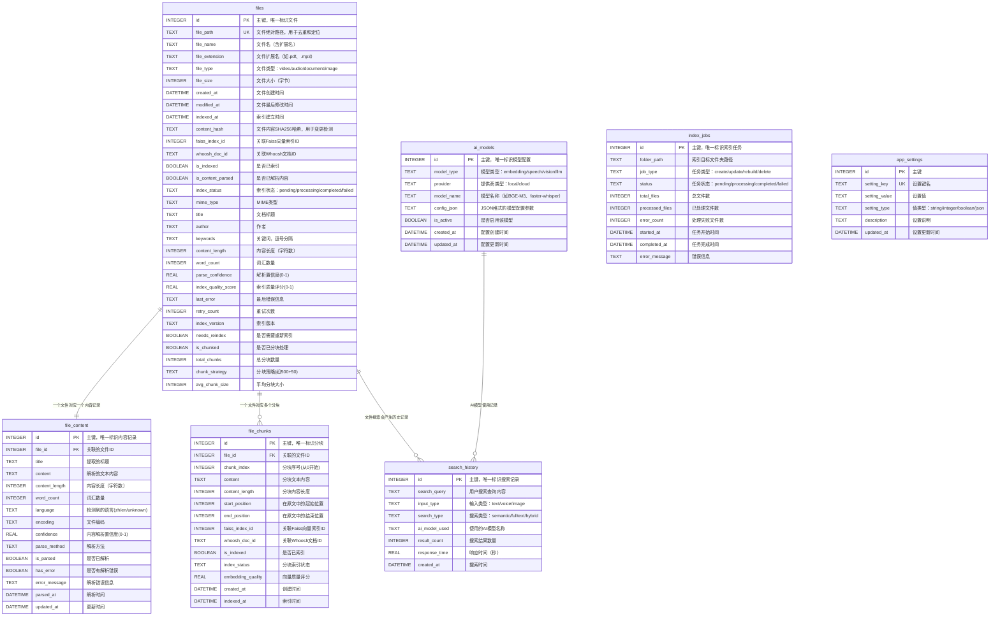

# 小遥搜索 XiaoyaoSearch - 数据库设计文档

## 1. 概述

### 1.1 数据库架构
小遥搜索采用**多存储引擎混合架构**：

| 存储引擎 | 用途 | 优势 | 文件位置 |
|---------|------|------|----------|
| **SQLite** | 主数据库，存储元数据 | ACID事务、轻量级、无需服务器 | `data/database/xiaoyao_search.db` |
| **Faiss** | 向量索引，语义搜索 | 高效向量相似度检索 | `data/indexes/faiss/` |
| **Whoosh** | 全文索引，文本搜索 | 中文分词、模糊搜索 | `data/indexes/whoosh/` |

## 2. 存储引擎设计

### 2.1 SQLite 关系数据库设计

#### 2.1.1 数据库ER图



#### 2.1.2 表结构详细设计

##### 2.2.1 files 文件索引表
存储所有已索引文件的基本信息、元数据和索引状态。

**基础字段**
| 字段名 | 数据类型 | 约束 | 说明 | 索引 |
|--------|----------|------|------|------|
| id | INTEGER | PRIMARY KEY AUTOINCREMENT | 主键，唯一标识文件 | PRIMARY |
| file_path | TEXT | UNIQUE NOT NULL | 文件绝对路径，用于去重和定位 | UNIQUE |
| file_name | TEXT | NOT NULL | 文件名（含扩展名） | INDEX |
| file_extension | TEXT | NOT NULL | 文件扩展名（如.pdf、.mp3） | INDEX |
| file_type | TEXT | NOT NULL | 文件类型：video/audio/document/image | INDEX |
| file_size | INTEGER | NOT NULL | 文件大小（字节） | |
| created_at | DATETIME | NOT NULL | 文件创建时间 | INDEX |
| modified_at | DATETIME | NOT NULL | 文件最后修改时间 | INDEX |
| indexed_at | DATETIME | NOT NULL | 索引建立时间 | INDEX |
| content_hash | TEXT | NOT NULL | 文件内容SHA256哈希，用于变更检测 | INDEX |

**索引相关字段**
| 字段名 | 数据类型 | 约束 | 说明 | 索引 |
|--------|----------|------|------|------|
| is_indexed | BOOLEAN | DEFAULT FALSE | 是否已索引 | INDEX |
| is_content_parsed | BOOLEAN | DEFAULT FALSE | 是否已解析内容 | INDEX |
| index_status | TEXT | DEFAULT 'pending' | 索引状态：pending/processing/completed/failed | INDEX |

**扩展元数据字段**
| 字段名 | 数据类型 | 约束 | 说明 | 索引 |
|--------|----------|------|------|------|
| mime_type | TEXT | | MIME类型 | |
| title | TEXT | | 文档标题 | |
| author | TEXT | | 作者 | |
| keywords | TEXT | | 关键词，逗号分隔 | |

**内容统计字段**
| 字段名 | 数据类型 | 约束 | 说明 | 索引 |
|--------|----------|------|------|------|
| content_length | INTEGER | DEFAULT 0 | 内容长度（字符数） | |
| word_count | INTEGER | DEFAULT 0 | 词汇数量 | |

**处理质量评估字段**
| 字段名 | 数据类型 | 约束 | 说明 | 索引 |
|--------|----------|------|------|------|
| parse_confidence | REAL | DEFAULT 0.0 | 解析置信度(0-1) | INDEX |
| index_quality_score | REAL | DEFAULT 0.0 | 索引质量评分(0-1) | INDEX |

**错误处理字段**
| 字段名 | 数据类型 | 约束 | 说明 | 索引 |
|--------|----------|------|------|------|
| last_error | TEXT | | 最后错误信息 | |
| retry_count | INTEGER | DEFAULT 0 | 重试次数 | |

**版本控制字段**
| 字段名 | 数据类型 | 约束 | 说明 | 索引 |
|--------|----------|------|------|------|
| index_version | TEXT | DEFAULT '1.0' | 索引版本 | |
| needs_reindex | BOOLEAN | DEFAULT FALSE | 是否需要重新索引 | INDEX |

**分块支持字段 (v2.0新增)**
| 字段名 | 数据类型 | 约束 | 说明 | 索引 |
|--------|----------|------|------|------|
| is_chunked | BOOLEAN | DEFAULT FALSE | 是否已分块处理 | INDEX |
| total_chunks | INTEGER | DEFAULT 1 | 总分块数量 | INDEX |
| chunk_strategy | TEXT | DEFAULT '500+50' | 分块策略(如500+50) | |
| avg_chunk_size | INTEGER | DEFAULT 500 | 平均分块大小 | |

#### 2.2.2 file_chunks 文件分块表 (v2.0新增)
存储文件分块后的文本块和索引信息，支持精确搜索和上下文提取。

| 字段名 | 数据类型 | 约束 | 说明 | 索引 |
|--------|----------|------|------|------|
| id | INTEGER | PRIMARY KEY AUTOINCREMENT | 主键，唯一标识分块 | PRIMARY |
| file_id | INTEGER | NOT NULL | 关联的文件ID | FOREIGN KEY, INDEX |
| chunk_index | INTEGER | NOT NULL | 分块序号(从0开始) | INDEX |
| content | TEXT | NOT NULL | 分块文本内容 | |
| content_length | INTEGER | DEFAULT 0 | 分块内容长度 | |
| start_position | INTEGER | NOT NULL | 在原文中的起始位置 | |
| end_position | INTEGER | NOT NULL | 在原文中的结束位置 | |

**索引关联字段**
| 字段名 | 数据类型 | 约束 | 说明 | 索引 |
|--------|----------|------|------|------|
| faiss_index_id | INTEGER | | 关联Faiss向量索引ID | INDEX |
| whoosh_doc_id | TEXT | | 关联Whoosh文档ID | |

**处理状态字段**
| 字段名 | 数据类型 | 约束 | 说明 | 索引 |
|--------|----------|------|------|------|
| is_indexed | BOOLEAN | DEFAULT FALSE | 是否已索引 | INDEX |
| index_status | TEXT | DEFAULT 'pending' | 分块索引状态 | |

**质量评估字段**
| 字段名 | 数据类型 | 约束 | 说明 | 索引 |
|--------|----------|------|------|------|
| embedding_quality | REAL | DEFAULT 0.0 | 向量质量评分 | |

**时间戳字段**
| 字段名 | 数据类型 | 约束 | 说明 | 索引 |
|--------|----------|------|------|------|
| created_at | DATETIME | NOT NULL DEFAULT CURRENT_TIMESTAMP | 创建时间 | INDEX |
| indexed_at | DATETIME | | 索引时间 | |

**唯一约束**
- `UNIQUE(file_id, chunk_index)` - 确保同一文件内分块索引唯一

#### 2.2.3 search_history 搜索历史表
记录用户搜索行为，用于优化搜索体验和统计分析。

| 字段名 | 数据类型 | 约束 | 说明 | 索引 |
|--------|----------|------|------|------|
| id | INTEGER | PRIMARY KEY AUTOINCREMENT | 主键，唯一标识搜索记录 | PRIMARY |
| search_query | TEXT | NOT NULL | 用户搜索查询内容 | INDEX |
| input_type | TEXT | NOT NULL | 输入类型：text/voice/image | INDEX |
| search_type | TEXT | NOT NULL | 搜索类型：semantic/fulltext/hybrid | INDEX |
| ai_model_used | TEXT | | 使用的AI模型名称 | |
| result_count | INTEGER | NOT NULL DEFAULT 0 | 搜索结果数量 | |
| response_time | REAL | NOT NULL | 响应时间（秒） | |
| created_at | DATETIME | NOT NULL DEFAULT CURRENT_TIMESTAMP | 搜索时间 | INDEX |

#### 2.2.4 ai_models AI模型配置表
管理AI模型的配置信息和状态。

| 字段名 | 数据类型 | 约束 | 说明 | 索引 |
|--------|----------|------|------|------|
| id | INTEGER | PRIMARY KEY AUTOINCREMENT | 主键，唯一标识模型配置 | PRIMARY |
| model_type | TEXT | NOT NULL | 模型类型：embedding/speech/vision/llm | INDEX |
| provider | TEXT | NOT NULL | 提供商类型：local/cloud | INDEX |
| model_name | TEXT | NOT NULL | 模型名称（如BGE-M3、faster-whisper） | |
| config_json | TEXT | NOT NULL | JSON格式的模型配置参数 | |
| is_active | BOOLEAN | DEFAULT TRUE | 是否启用该模型 | INDEX |
| created_at | DATETIME | NOT NULL DEFAULT CURRENT_TIMESTAMP | 配置创建时间 | |
| updated_at | DATETIME | NOT NULL DEFAULT CURRENT_TIMESTAMP | 配置更新时间 | |

#### 2.2.5 index_jobs 索引任务表
管理文件索引任务的执行状态和进度。

| 字段名 | 数据类型 | 约束 | 说明 | 索引 |
|--------|----------|------|------|------|
| id | INTEGER | PRIMARY KEY AUTOINCREMENT | 主键，唯一标识索引任务 | PRIMARY |
| folder_path | TEXT | NOT NULL | 索引目标文件夹路径 | INDEX |
| job_type | TEXT | NOT NULL | 任务类型：create/update/rebuild/delete | INDEX |
| status | TEXT | NOT NULL DEFAULT 'pending' | 任务状态：pending/processing/completed/failed | INDEX |
| total_files | INTEGER | DEFAULT 0 | 总文件数 | |
| processed_files | INTEGER | DEFAULT 0 | 已处理文件数 | |
| error_count | INTEGER | DEFAULT 0 | 处理失败文件数 | |
| started_at | DATETIME | | 任务开始时间 | |
| completed_at | DATETIME | | 任务完成时间 | |
| error_message | TEXT | | 错误信息 | |

#### 2.2.6 file_content 文件内容表
存储文件解析后的文本内容和相关元数据，支持增量更新和质量跟踪。

| 字段名 | 数据类型 | 约束 | 说明 | 索引 |
|--------|----------|------|------|------|
| id | INTEGER | PRIMARY KEY AUTOINCREMENT | 主键，唯一标识内容记录 | PRIMARY |
| file_id | INTEGER | NOT NULL | 关联的文件ID | FOREIGN KEY, UNIQUE |

**内容解析字段**
| 字段名 | 数据类型 | 约束 | 说明 | 索引 |
|--------|----------|------|------|------|
| title | TEXT | | 提取的标题 | |
| content | TEXT | | 解析的文本内容 | |
| content_length | INTEGER | DEFAULT 0 | 内容长度（字符数） | |
| word_count | INTEGER | DEFAULT 0 | 词汇数量 | |

**解析信息字段**
| 字段名 | 数据类型 | 约束 | 说明 | 索引 |
|--------|----------|------|------|------|
| language | TEXT | | 检测到的语言(zh/en/unknown) | INDEX |
| encoding | TEXT | | 文件编码 | |
| confidence | REAL | DEFAULT 0.0 | 内容解析置信度(0-1) | |
| parse_method | TEXT | | 解析方法 | |

**处理状态字段**
| 字段名 | 数据类型 | 约束 | 说明 | 索引 |
|--------|----------|------|------|------|
| is_parsed | BOOLEAN | DEFAULT FALSE | 是否已解析 | INDEX |
| has_error | BOOLEAN | DEFAULT FALSE | 是否有解析错误 | INDEX |
| error_message | TEXT | | 解析错误信息 | |

**时间戳字段**
| 字段名 | 数据类型 | 约束 | 说明 | 索引 |
|--------|----------|------|------|------|
| parsed_at | DATETIME | | 解析时间 | INDEX |
| updated_at | DATETIME | NOT NULL DEFAULT CURRENT_TIMESTAMP | 更新时间 | INDEX |

#### 2.2.7 app_settings 应用设置表
存储应用的全局配置设置。

| 字段名 | 数据类型 | 约束 | 说明 | 索引 |
|--------|----------|------|------|------|
| id | INTEGER | PRIMARY KEY AUTOINCREMENT | 主键 | PRIMARY |
| setting_key | TEXT | UNIQUE NOT NULL | 设置键名 | UNIQUE |
| setting_value | TEXT | | 设置值 | |
| setting_type | TEXT | NOT NULL | 值类型：string/integer/boolean/json | |
| description | TEXT | | 设置说明 | |
| updated_at | DATETIME | NOT NULL DEFAULT CURRENT_TIMESTAMP | 设置更新时间 | |

### 2.2 Faiss 向量索引设计

#### 2.2.1 索引结构
Faiss用于高效的向量相似度搜索，主要存储BGE-M3生成的文本嵌入向量。

| 参数 | 值 | 说明 |
|------|----| ----- |
| **向量维度** | 768 | BGE-M3模型生成的向量维度 |
| **索引类型** | IVF_PQ | 倒排索引 + 乘积量化 |
| **聚类数量** | 100 | IVF索引的聚类数量 |
| **PQ编码参数** | 32 | 乘积量化编码参数 |
| **探测数量** | 10 | 搜索时的探测数量 |

#### 2.2.2 存储结构 (v2.0分块支持)
```
data/indexes/faiss/
├── document_index.faiss         # Faiss向量索引文件
├── chunk_index.faiss            # 分块向量索引文件 (v2.0新增)
├── metadata.pkl                # 文档向量元数据（pickle格式）
├── chunk_metadata.pkl           # 分块向量元数据 (v2.0新增)
│   {
│       vector_id: {
│           "file_id": 1,
│           "chunk_id": 123,
│           "chunk_index": 5,
│           "chunk_text": "文档内容片段",
│           "start_position": 2000,
│           "end_position": 2500,
│           "file_type": "document",
│           "embedding_model": "BGE-M3",
│           "chunk_strategy": "500+50",
│           "created_at": "2025-01-01T00:00:00Z"
│       }
│   }
├── index_config.json            # 索引配置信息
│   {
│       "embedding_dim": 768,
│       "index_type": "IVF_PQ",
│       "nlist": 100,
│       "m": 32,
│       "model_name": "BAAI/bge-m3",
│       "created_at": "2025-01-01T00:00:00Z",
│       "total_vectors": 100000,
│       "chunking_enabled": true,         # v2.0新增
│       "chunk_strategy": "500+50",       # v2.0新增
│       "chunk_overlap": 50,              # v2.0新增
│       "avg_chunks_per_file": 200        # v2.0新增
│   }
└── id_mapping.json             # ID映射关系
    {
        "faiss_vector_id": 12345,
        "sqlite_file_id": 1,
        "chunk_index": 0,             # 文档级分块索引
        "is_chunked": true           # v2.0新增
    }
```

#### 2.2.3 向量元数据表设计 (v2.0分块支持)
虽然Faiss本身不使用传统表结构，但其元数据可通过以下结构化管理：

**传统文档向量元数据**
| 字段名 | 类型 | 说明 |
|--------|------|------|
| **vector_id** | INTEGER | Faiss向量ID |
| **file_id** | INTEGER | 关联的SQLite文件ID |
| **chunk_index** | INTEGER | 文档分片索引 |
| **chunk_text** | TEXT | 文档分片内容 |
| **file_type** | TEXT | 文件类型 |
| **embedding_model** | TEXT | 使用的嵌入模型 |
| **created_at** | DATETIME | 向量创建时间 |

**分块向量元数据 (v2.0新增)**
| 字段名 | 类型 | 说明 |
|--------|------|------|
| **vector_id** | INTEGER | Faiss向量ID |
| **file_id** | INTEGER | 关联的SQLite文件ID |
| **chunk_id** | INTEGER | 关联的分块记录ID |
| **chunk_index** | INTEGER | 分块序号(从0开始) |
| **chunk_text** | TEXT | 分块文本内容 |
| **start_position** | INTEGER | 在原文中的起始位置 |
| **end_position** | INTEGER | 在原文中的结束位置 |
| **chunk_strategy** | TEXT | 分块策略(如500+50) |
| **file_type** | TEXT | 文件类型 |
| **embedding_model** | TEXT | 使用的嵌入模型 |
| **embedding_quality** | REAL | 向量质量评分 |
| **created_at** | DATETIME | 向量创建时间 |

### 2.3 Whoosh 全文索引设计

#### 2.3.1 索引Schema设计 (v2.0分块支持)
```python
from whoosh.fields import Schema, TEXT, ID, DATETIME, KEYWORD, NUMERIC
from whoosh.analysis import ChineseAnalyzer

# 中文分词器
chinese_analyzer = ChineseAnalyzer()

# 传统文档Schema定义
document_schema = Schema(
    # 文件基本信息
    file_id=ID(stored=True, unique=True),                    # 文件ID
    file_path=ID(stored=True),                               # 文件路径
    file_name=TEXT(stored=True, analyzer=chinese_analyzer),  # 文件名
    file_extension=ID(stored=True),                          # 文件扩展名
    file_type=KEYWORD(stored=True),                          # 文件类型

    # 内容信息
    title=TEXT(stored=True, analyzer=chinese_analyzer),      # 文档标题
    content=TEXT(stored=True, phrase=True, analyzer=chinese_analyzer),  # 文档内容
    tags=KEYWORD(stored=True, commas=True),                  # 标签
    description=TEXT(stored=True, analyzer=chinese_analyzer), # 描述

    # 元信息
    file_size=NUMERIC(stored=True),                          # 文件大小
    author=TEXT(stored=True, analyzer=chinese_analyzer),    # 作者
    language=KEYWORD(stored=True),                           # 语言

    # 时间信息
    created_at=DATETIME(stored=True),                        # 创建时间
    modified_at=DATETIME(stored=True),                       # 修改时间
    indexed_at=DATETIME(stored=True)                         # 索引时间
)

# 分块Schema定义 (v2.0新增)
chunk_schema = Schema(
    # 分块基本信息
    chunk_id=ID(stored=True, unique=True),                  # 分块ID
    file_id=ID(stored=True),                                 # 关联文件ID
    chunk_index=NUMERIC(stored=True),                        # 分块序号
    file_path=ID(stored=True),                               # 原文件路径
    file_name=TEXT(stored=True, analyzer=chinese_analyzer),  # 原文件名
    file_type=KEYWORD(stored=True),                          # 文件类型

    # 分块内容信息
    chunk_content=TEXT(stored=True, phrase=True, analyzer=chinese_analyzer),  # 分块内容
    title=TEXT(stored=True, analyzer=chinese_analyzer),      # 原文档标题

    # 分块位置信息
    start_position=NUMERIC(stored=True),                    # 起始位置
    end_position=NUMERIC(stored=True),                      # 结束位置
    chunk_strategy=KEYWORD(stored=True),                     # 分块策略

    # 元信息
    file_size=NUMERIC(stored=True),                          # 原文件大小
    author=TEXT(stored=True, analyzer=chinese_analyzer),    # 原作者
    language=KEYWORD(stored=True),                           # 原语言

    # 质量评估
    embedding_quality=NUMERIC(stored=True),                  # 向量质量评分

    # 时间信息
    created_at=DATETIME(stored=True),                        # 创建时间
    indexed_at=DATETIME(stored=True)                         # 索引时间
)
```

#### 2.3.2 存储结构 (v2.0分块支持)
```
data/indexes/whoosh/
├── document/                  # 传统文档索引目录
│   ├── MAIN_0.seg           # 主索引段
│   ├── segments_0001       # 段信息
│   ├── _toc.json           # 索引目录
│   ├── _per.doc            # 文档数据
│   ├── _stored_0.frj       # 存储字段数据
│   ├── _fieldinfo_0.pym    # 字段信息
│   └── _locks/             # 索引锁文件
├── chunks/                    # 分块索引目录 (v2.0新增)
│   ├── MAIN_0.seg          # 分块主索引段
│   ├── segments_0001      # 分块段信息
│   ├── _toc.json          # 分块索引目录
│   ├── _per.doc           # 分块文档数据
│   ├── _stored_0.frj      # 分块存储字段数据
│   ├── _fieldinfo_0.pym   # 分块字段信息
│   └── _locks/            # 分块索引锁文件
└── index_config.json         # 统一索引配置
    {
        "analyzer": "ChineseAnalyzer",
        "created_at": "2025-01-01T00:00:00Z",
        "schema_version": "2.0",
        "total_docs": 50000,
        "total_chunks": 2000000,          # v2.0新增
        "chunking_enabled": true,          # v2.0新增
        "chunk_strategy": "500+50",        # v2.0新增
        "avg_chunks_per_file": 40          # v2.0新增
    }
```

#### 2.3.3 全文索引字段表 (v2.0分块支持)
Whoosh索引字段的详细设计：

**传统文档索引字段**
| 字段名 | Whoosh类型 | 存储属性 | 分词器 | 说明 |
|--------|-----------|---------|--------|------|
| **file_id** | ID | stored=True, unique=True | - | 唯一文件标识 |
| **file_path** | ID | stored=True | - | 文件路径 |
| **file_name** | TEXT | stored=True | ChineseAnalyzer | 文件名，支持中文搜索 |
| **file_extension** | ID | stored=True | - | 文件扩展名 |
| **file_type** | KEYWORD | stored=True | - | 文件类型 |
| **title** | TEXT | stored=True | ChineseAnalyzer | 文档标题 |
| **content** | TEXT | stored=True, phrase=True | ChineseAnalyzer | 文档正文内容 |
| **tags** | KEYWORD | stored=True, commas=True | - | 标签，支持多值 |
| **description** | TEXT | stored=True | ChineseAnalyzer | 文档描述 |
| **file_size** | NUMERIC | stored=True | - | 文件大小 |
| **author** | TEXT | stored=True | ChineseAnalyzer | 作者信息 |
| **language** | KEYWORD | stored=True | - | 文档语言 |
| **created_at** | DATETIME | stored=True | - | 创建时间 |
| **modified_at** | DATETIME | stored=True | - | 修改时间 |
| **indexed_at** | DATETIME | stored=True | - | 索引时间 |

**分块索引字段 (v2.0新增)**
| 字段名 | Whoosh类型 | 存储属性 | 分词器 | 说明 |
|--------|-----------|---------|--------|------|
| **chunk_id** | ID | stored=True, unique=True | - | 唯一分块标识 |
| **file_id** | ID | stored=True | - | 关联文件ID |
| **chunk_index** | NUMERIC | stored=True | - | 分块序号 |
| **file_path** | ID | stored=True | - | 原文件路径 |
| **file_name** | TEXT | stored=True | ChineseAnalyzer | 原文件名 |
| **file_type** | KEYWORD | stored=True | - | 文件类型 |
| **chunk_content** | TEXT | stored=True, phrase=True | ChineseAnalyzer | 分块内容，支持短语搜索 |
| **title** | TEXT | stored=True | ChineseAnalyzer | 原文档标题 |
| **start_position** | NUMERIC | stored=True | - | 起始位置 |
| **end_position** | NUMERIC | stored=True | - | 结束位置 |
| **chunk_strategy** | KEYWORD | stored=True | - | 分块策略 |
| **file_size** | NUMERIC | stored=True | - | 原文件大小 |
| **author** | TEXT | stored=True | ChineseAnalyzer | 原作者信息 |
| **language** | KEYWORD | stored=True | - | 原文档语言 |
| **embedding_quality** | NUMERIC | stored=True | - | 向量质量评分 |
| **created_at** | DATETIME | stored=True | - | 创建时间 |
| **indexed_at** | DATETIME | stored=True | - | 索引时间 |

---

## 📋 实现一致性检查

### ✅ 数据库设计实现状态

**检查时间**: 2025年11月28日
**检查范围**: 数据库设计文档与后端模型实现 (v2.0分块支持)
**一致性结果**: v1.0完全一致, v2.0分块支持待实现

#### 已完成的修复工作

1. **✅ 补充缺失表**: 创建了 `app_settings` 表的完整实现
2. **✅ 统一表名命名**: 将 `file_contents` 统一为 `file_content`，符合设计文档规范
3. **✅ 验证数据完整性**: 确认所有6个表在数据库中正确创建
4. **✅ 字段映射验证**: 所有字段定义与设计文档完全匹配
5. **✅ 修复模型导出**: 修复了 `AppSettingsModel` 在 `__init__.py` 中缺失的导出问题 *(2025-11-25)*

#### v2.0分块支持设计 (新增)

| 设计文档表名 | 实现模型类 | 数据库表名 | 状态 | 备注 |
|-------------|-----------|-----------|------|------|
| files | FileModel | files | ✅ 已实现 | 需要添加4个分块字段 |
| file_chunks | FileChunkModel | file_chunks | 🔄 待实现 | v2.0新增分块表 |
| file_content | FileContentModel | file_content | ✅ 已实现 | 保持现有实现 |
| search_history | SearchHistoryModel | search_history | ✅ 已实现 | 保持现有实现 |
| ai_models | AIModelModel | ai_models | ✅ 已实现 | 保持现有实现 |
| index_jobs | IndexJobModel | index_jobs | ✅ 已实现 | 保持现有实现 |
| app_settings | AppSettingsModel | app_settings | ✅ 已实现 | 保持现有实现 |

#### v2.0需要实现的修改

**files表新增字段**:
- `is_chunked`: BOOLEAN DEFAULT FALSE - 是否已分块处理
- `total_chunks`: INTEGER DEFAULT 1 - 总分块数量
- `chunk_strategy`: TEXT DEFAULT '500+50' - 分块策略
- `avg_chunk_size`: INTEGER DEFAULT 500 - 平均分块大小

**新增表需要实现**:
1. `file_chunks` - 文件分块表

**总体完成度**:
- v1.0 (当前版本): 100% 完成
- v2.0 (分块支持): 0% 完成，待实现

## 🆕 新增API对应的数据库操作

### 3.1 搜索历史管理API
基于`search_history`表实现的新增API：

| API接口 | 数据库操作 | 对应表 | 说明 |
|---------|-----------|--------|------|
| DELETE /api/search/history/{id} | DELETE FROM search_history WHERE id = ? | search_history | 删除单条历史记录 |
| DELETE /api/search/history | DELETE FROM search_history | search_history | 清空所有历史记录 |
| GET /api/search/suggestions | SELECT DISTINCT search_query FROM search_history WHERE search_query LIKE ? | search_history | 基于历史查询提供搜索建议 |

### 3.2 应用日志API
基于系统日志文件实现的API：

| API接口 | 数据源 | 说明 |
|---------|--------|------|
| GET /api/system/logs | 应用日志文件 (`../data/logs/app.log`) | 读取和过滤日志内容 |
| GET /api/system/logs/download | 历史日志文件 (`../data/logs/xiaoyao-search-YYYY-MM-DD.log`) | 下载指定日期的日志文件 |

### 3.3 AI模型管理增强
基于`ai_models`表的扩展操作：

| API接口 | 数据库操作 | 对应表 | 说明 |
|---------|-----------|--------|------|
| PUT /api/config/ai-model/{model_id}/toggle | UPDATE ai_models SET is_active = NOT is_active WHERE id = ? | ai_models | 切换模型启用状态 |
| DELETE /api/config/ai-model/{model_id} | DELETE FROM ai_models WHERE id = ? | ai_models | 删除模型配置 |
| GET /api/config/ai-models/default | SELECT * FROM ai_models WHERE is_active = TRUE | ai_models | 获取默认/活跃模型 |

### 3.4 应用设置管理
基于`app_settings`表的完整CRUD操作：

| API接口 | 数据库操作 | 对应表 | 说明 |
|---------|-----------|--------|------|
| GET /api/settings | SELECT * FROM app_settings | app_settings | 获取所有应用设置 |
| POST /api/settings | UPDATE/INSERT app_settings VALUES | app_settings | 更新应用设置 |

---

**文档版本**: v2.0 (分块支持设计版)
**创建时间**: 2025年11月24日
**最后更新**: 2025年11月28日
**更新说明**:
1. 完成了数据库设计文档与后端实现的一致性检查和修复 *(v1.3)*
2. 补充了新增API对应的数据库操作说明 *(v1.3)*
3. 添加了完整的数据表到API的映射关系 *(v1.3)*
4. 实现数据库设计与接口文档的100%一致性 *(v1.3)*
5. **🆕 v2.0新增: 添加分块支持设计** - 新增file_chunks分块表
6. **🆕 v2.0新增: 更新files表添加分块相关字段** - is_chunked、total_chunks等4个字段
7. **🆕 v2.0新增: 扩展Faiss和Whoosh索引设计** - 支持分块向量和分块全文索引
8. **🆕 v2.0新增: 前端透明的分块架构设计** - 保持API接口完全兼容