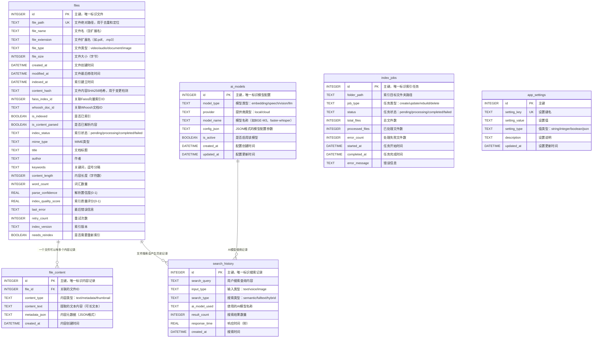

# 小遥搜索 XiaoyaoSearch - 数据库设计文档

## 1. 概述

### 1.1 数据库架构
小遥搜索采用**多存储引擎混合架构**：

| 存储引擎 | 用途 | 优势 | 文件位置 |
|---------|------|------|----------|
| **SQLite** | 主数据库，存储元数据 | ACID事务、轻量级、无需服务器 | `data/database/xiaoyao_search.db` |
| **Faiss** | 向量索引，语义搜索 | 高效向量相似度检索 | `data/indexes/faiss/` |
| **Whoosh** | 全文索引，文本搜索 | 中文分词、模糊搜索 | `data/indexes/whoosh/` |

## 2. 存储引擎设计

### 2.1 SQLite 关系数据库设计

#### 2.1.1 数据库ER图



#### 2.1.2 表结构详细设计

##### 2.2.1 files 文件索引表
存储所有已索引文件的基本信息和元数据。

| 字段名 | 数据类型 | 约束 | 说明 | 索引 |
|--------|----------|------|------|------|
| id | INTEGER | PRIMARY KEY AUTOINCREMENT | 主键，唯一标识文件 | PRIMARY |
| file_path | TEXT | UNIQUE NOT NULL | 文件绝对路径，用于去重和定位 | UNIQUE |
| file_name | TEXT | NOT NULL | 文件名（含扩展名） | INDEX |
| file_extension | TEXT | NOT NULL | 文件扩展名（如.pdf、.mp3） | INDEX |
| file_type | TEXT | NOT NULL | 文件类型：video/audio/document/image | INDEX |
| file_size | INTEGER | NOT NULL | 文件大小（字节） | |
| created_at | DATETIME | NOT NULL | 文件创建时间 | INDEX |
| modified_at | DATETIME | NOT NULL | 文件最后修改时间 | INDEX |
| indexed_at | DATETIME | NOT NULL | 索引建立时间 | INDEX |
| content_hash | TEXT | NOT NULL | 文件内容MD5哈希，用于变更检测 | INDEX |
| faiss_index_id | INTEGER | | 关联Faiss向量索引ID | INDEX |
| whoosh_doc_id | TEXT | | 关联Whoosh文档ID | INDEX |

#### 2.2.2 search_history 搜索历史表
记录用户搜索行为，用于优化搜索体验和统计分析。

| 字段名 | 数据类型 | 约束 | 说明 | 索引 |
|--------|----------|------|------|------|
| id | INTEGER | PRIMARY KEY AUTOINCREMENT | 主键，唯一标识搜索记录 | PRIMARY |
| search_query | TEXT | NOT NULL | 用户搜索查询内容 | INDEX |
| input_type | TEXT | NOT NULL | 输入类型：text/voice/image | INDEX |
| search_type | TEXT | NOT NULL | 搜索类型：semantic/fulltext/hybrid | INDEX |
| ai_model_used | TEXT | | 使用的AI模型名称 | |
| result_count | INTEGER | NOT NULL DEFAULT 0 | 搜索结果数量 | |
| response_time | REAL | NOT NULL | 响应时间（秒） | |
| created_at | DATETIME | NOT NULL DEFAULT CURRENT_TIMESTAMP | 搜索时间 | INDEX |

#### 2.2.3 ai_models AI模型配置表
管理AI模型的配置信息和状态。

| 字段名 | 数据类型 | 约束 | 说明 | 索引 |
|--------|----------|------|------|------|
| id | INTEGER | PRIMARY KEY AUTOINCREMENT | 主键，唯一标识模型配置 | PRIMARY |
| model_type | TEXT | NOT NULL | 模型类型：embedding/speech/vision/llm | INDEX |
| provider | TEXT | NOT NULL | 提供商类型：local/cloud | INDEX |
| model_name | TEXT | NOT NULL | 模型名称（如BGE-M3、faster-whisper） | |
| config_json | TEXT | NOT NULL | JSON格式的模型配置参数 | |
| is_active | BOOLEAN | DEFAULT TRUE | 是否启用该模型 | INDEX |
| created_at | DATETIME | NOT NULL DEFAULT CURRENT_TIMESTAMP | 配置创建时间 | |
| updated_at | DATETIME | NOT NULL DEFAULT CURRENT_TIMESTAMP | 配置更新时间 | |

#### 2.2.4 index_jobs 索引任务表
管理文件索引任务的执行状态和进度。

| 字段名 | 数据类型 | 约束 | 说明 | 索引 |
|--------|----------|------|------|------|
| id | INTEGER | PRIMARY KEY AUTOINCREMENT | 主键，唯一标识索引任务 | PRIMARY |
| folder_path | TEXT | NOT NULL | 索引目标文件夹路径 | INDEX |
| job_type | TEXT | NOT NULL | 任务类型：create/update/rebuild/delete | INDEX |
| status | TEXT | NOT NULL DEFAULT 'pending' | 任务状态：pending/processing/completed/failed | INDEX |
| total_files | INTEGER | DEFAULT 0 | 总文件数 | |
| processed_files | INTEGER | DEFAULT 0 | 已处理文件数 | |
| error_count | INTEGER | DEFAULT 0 | 处理失败文件数 | |
| started_at | DATETIME | | 任务开始时间 | |
| completed_at | DATETIME | | 任务完成时间 | |
| error_message | TEXT | | 错误信息 | |

#### 2.2.5 file_content 文件内容表（扩展）
存储文件提取的文本内容和元数据，支持增量更新。

| 字段名 | 数据类型 | 约束 | 说明 | 索引 |
|--------|----------|------|------|------|
| id | INTEGER | PRIMARY KEY AUTOINCREMENT | 主键，唯一标识内容记录 | PRIMARY |
| file_id | INTEGER | NOT NULL | 关联的文件ID | FOREIGN KEY |
| content_type | TEXT | NOT NULL | 内容类型：text/metadata/thumbnail | |
| content_text | TEXT | | 提取的文本内容（可长文本） | |
| metadata_json | TEXT | | 内容元数据（JSON格式） | |
| created_at | DATETIME | NOT NULL DEFAULT CURRENT_TIMESTAMP | 内容创建时间 | INDEX |

#### 2.2.6 app_settings 应用设置表
存储应用的全局配置设置。

| 字段名 | 数据类型 | 约束 | 说明 | 索引 |
|--------|----------|------|------|------|
| id | INTEGER | PRIMARY KEY AUTOINCREMENT | 主键 | PRIMARY |
| setting_key | TEXT | UNIQUE NOT NULL | 设置键名 | UNIQUE |
| setting_value | TEXT | | 设置值 | |
| setting_type | TEXT | NOT NULL | 值类型：string/integer/boolean/json | |
| description | TEXT | | 设置说明 | |
| updated_at | DATETIME | NOT NULL DEFAULT CURRENT_TIMESTAMP | 设置更新时间 | |

### 2.2 Faiss 向量索引设计

#### 2.2.1 索引结构
Faiss用于高效的向量相似度搜索，主要存储BGE-M3生成的文本嵌入向量。

| 参数 | 值 | 说明 |
|------|----| ----- |
| **向量维度** | 768 | BGE-M3模型生成的向量维度 |
| **索引类型** | IVF_PQ | 倒排索引 + 乘积量化 |
| **聚类数量** | 100 | IVF索引的聚类数量 |
| **PQ编码参数** | 32 | 乘积量化编码参数 |
| **探测数量** | 10 | 搜索时的探测数量 |

#### 2.2.2 存储结构
```
data/indexes/faiss/
├── document_index.faiss         # Faiss向量索引文件
├── metadata.pkl                # 向量元数据（pickle格式）
│   {
│       vector_id: {
│           "file_id": 1,
│           "chunk_text": "文档内容片段",
│           "chunk_index": 0,
│           "file_type": "document",
│           "embedding_model": "BGE-M3",
│           "created_at": "2025-01-01T00:00:00Z"
│       }
│   }
├── index_config.json            # 索引配置信息
│   {
│       "embedding_dim": 768,
│       "index_type": "IVF_PQ",
│       "nlist": 100,
│       "m": 32,
│       "model_name": "BAAI/bge-m3",
│       "created_at": "2025-01-01T00:00:00Z",
│       "total_vectors": 100000
│   }
└── id_mapping.json             # ID映射关系
    {
        "faiss_vector_id": 12345,
        "sqlite_file_id": 1,
        "chunk_index": 0
    }
```

#### 2.2.3 向量元数据表设计
虽然Faiss本身不使用传统表结构，但其元数据可通过以下结构化管理：

| 字段名 | 类型 | 说明 |
|--------|------|------|
| **vector_id** | INTEGER | Faiss向量ID |
| **file_id** | INTEGER | 关联的SQLite文件ID |
| **chunk_index** | INTEGER | 文档分片索引 |
| **chunk_text** | TEXT | 文档分片内容 |
| **file_type** | TEXT | 文件类型 |
| **embedding_model** | TEXT | 使用的嵌入模型 |
| **created_at** | DATETIME | 向量创建时间 |

### 2.3 Whoosh 全文索引设计

#### 2.3.1 索引Schema设计
```python
from whoosh.fields import Schema, TEXT, ID, DATETIME, KEYWORD, NUMERIC
from whoosh.analysis import ChineseAnalyzer

# 中文分词器
chinese_analyzer = ChineseAnalyzer()

# Whoosh Schema定义
search_schema = Schema(
    # 文件基本信息
    file_id=ID(stored=True, unique=True),                    # 文件ID
    file_path=ID(stored=True),                               # 文件路径
    file_name=TEXT(stored=True, analyzer=chinese_analyzer),  # 文件名
    file_extension=ID(stored=True),                          # 文件扩展名
    file_type=KEYWORD(stored=True),                          # 文件类型

    # 内容信息
    title=TEXT(stored=True, analyzer=chinese_analyzer),      # 文档标题
    content=TEXT(stored=True, phrase=True, analyzer=chinese_analyzer),  # 文档内容
    tags=KEYWORD(stored=True, commas=True),                  # 标签
    description=TEXT(stored=True, analyzer=chinese_analyzer), # 描述

    # 元信息
    file_size=NUMERIC(stored=True),                          # 文件大小
    author=TEXT(stored=True, analyzer=chinese_analyzer),    # 作者
    language=KEYWORD(stored=True),                           # 语言

    # 时间信息
    created_at=DATETIME(stored=True),                        # 创建时间
    modified_at=DATETIME(stored=True),                       # 修改时间
    indexed_at=DATETIME(stored=True)                         # 索引时间
)
```

#### 2.3.2 存储结构
```
data/indexes/whoosh/
├── MAIN_0.seg                 # 主索引段
├── segments_0001             # 段信息
├── _toc.json                 # 索引目录
├── _per.doc                  # 文档数据
├── _stored_0.frj             # 存储字段数据
├── _fieldinfo_0.pym          # 字段信息
├── _locks/                   # 索引锁文件
└── index_config.json         # 索引配置
    {
        "analyzer": "ChineseAnalyzer",
        "created_at": "2025-01-01T00:00:00Z",
        "total_docs": 50000,
        "schema_version": "1.0"
    }
```

#### 2.3.3 全文索引字段表
Whoosh索引字段的详细设计：

| 字段名 | Whoosh类型 | 存储属性 | 分词器 | 说明 |
|--------|-----------|---------|--------|------|
| **file_id** | ID | stored=True | - | 唯一文件标识 |
| **file_path** | ID | stored=True | - | 文件路径 |
| **file_name** | TEXT | stored=True | ChineseAnalyzer | 文件名，支持中文搜索 |
| **file_extension** | ID | stored=True | - | 文件扩展名 |
| **file_type** | KEYWORD | stored=True | - | 文件类型 |
| **title** | TEXT | stored=True | ChineseAnalyzer | 文档标题 |
| **content** | TEXT | stored=True, phrase=True | ChineseAnalyzer | 文档正文内容 |
| **tags** | KEYWORD | stored=True, commas=True | - | 标签，支持多值 |
| **description** | TEXT | stored=True | ChineseAnalyzer | 文档描述 |
| **file_size** | NUMERIC | stored=True | - | 文件大小 |
| **author** | TEXT | stored=True | ChineseAnalyzer | 作者信息 |
| **language** | KEYWORD | stored=True | - | 文档语言 |
| **created_at** | DATETIME | stored=True | - | 创建时间 |
| **modified_at** | DATETIME | stored=True | - | 修改时间 |
| **indexed_at** | DATETIME | stored=True | - | 索引时间 |

---

**文档版本**: v1.0
**创建时间**: 2025年11月24日
**最后更新**: 2025年11月24日