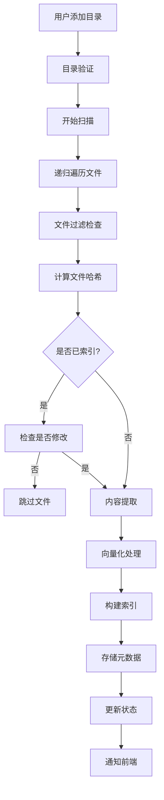
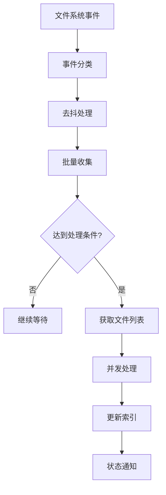

# 文件索引管理模块设计

## 架构概述
索引管理模块负责扫描、监控、处理本地文件，构建和维护多模态索引，为搜索引擎提供数据支持。

## 核心组件设计

### 1. 目录管理器 (DirectoryManager)
**职责**: 管理用户配置的扫描目录

**关键方法**:
```python
class DirectoryManager:
    def add_directory(self, path: str) -> bool
    def remove_directory(self, path: str) -> bool
    def get_directories(self) -> List[Directory]
    def validate_directory(self, path: str) -> ValidationResult
```

**数据结构**:
```python
@dataclass
class Directory:
    id: str
    path: str
    status: DirectoryStatus  # active, inactive, error
    file_count: int
    indexed_count: int
    last_scan_time: datetime
    created_at: datetime
```

### 2. 文件扫描器 (FileScanner)
**职责**: 扫描目录，识别文件，检测变化

**扫描策略**:
- **全量扫描**: 首次添加目录时执行
- **增量扫描**: 基于文件哈希检测变化
- **实时监控**: 使用watchdog监控文件系统事件

**文件过滤规则**:
```python
class FileFilter:
    EXCLUDED_EXTENSIONS = {'.tmp', '.log', '.cache'}
    EXCLUDED_DIRECTORIES = {'.git', 'node_modules', '__pycache__'}
    MAX_FILE_SIZE = 100 * 1024 * 1024  # 100MB

    def should_index(self, file_path: Path) -> bool:
        # 检查文件扩展名
        # 检查是否在排除目录中
        # 检查文件大小
        # 检查隐藏文件
```

### 3. 文件处理器 (FileProcessor)
**职责**: 提取不同格式文件的内容和元数据

**处理器架构**:
```python
class FileProcessor(ABC):
    @abstractmethod
    def can_process(self, file_path: Path) -> bool:
        pass

    @abstractmethod
    def extract_content(self, file_path: Path) -> FileContent:
        pass

class PDFProcessor(FileProcessor):
    def extract_content(self, file_path: Path) -> FileContent:
        # 使用Marker将PDF转换为Markdown
        # 提取文本内容和结构信息

class OfficeProcessor(FileProcessor):
    def extract_content(self, file_path: Path) -> FileContent:
        # 使用LibreOffice转换为PDF
        # 然后使用PDFProcessor处理

class TextProcessor(FileProcessor):
    def extract_content(self, file_path: Path) -> FileContent:
        # 直接读取文本内容
        # 处理编码问题
```

**内容提取结果**:
```python
@dataclass
class FileContent:
    text: str                    # 提取的文本内容
    metadata: Dict[str, Any]     # 文件元数据
    structure: Optional[Dict]    # 文档结构（标题、段落等）
    images: List[str]            # 图片路径列表
    links: List[str]             # 链接列表
```

### 4. 索引构建器 (IndexBuilder)
**职责**: 构建向量索引、全文索引和元数据索引

**多索引策略**:
```python
class IndexBuilder:
    def __init__(self):
        self.vector_indexer = VectorIndexer()   # Faiss
        self.text_indexer = TextIndexer()       # Whoosh
        self.metadata_store = MetadataStore()   # SQLite

    def build_indexes(self, file_content: FileContent, file_path: Path):
        # 1. 生成向量索引
        vector = self.embedding_model.encode(file_content.text)
        self.vector_indexer.add(file_path, vector)

        # 2. 构建全文索引
        self.text_indexer.add_document(file_path, file_content.text)

        # 3. 存储元数据
        metadata = self.extract_metadata(file_path, file_content)
        self.metadata_store.save(file_path, metadata)
```

### 5. 文件监控器 (FileWatcher)
**职责**: 实时监控文件系统变化

**监控事件处理**:
```python
class FileWatcher(FileSystemEventHandler):
    def __init__(self, index_manager):
        self.index_manager = index_manager
        self.debounce_timer = {}

    def on_created(self, event):
        if not event.is_directory:
            self.schedule_indexing(event.src_path, 'created')

    def on_modified(self, event):
        if not event.is_directory:
            self.schedule_indexing(event.src_path, 'modified')

    def schedule_indexing(self, file_path: str, event_type: str):
        # 5秒去抖处理
        # 批量收集事件
        # 异步处理索引更新
```

### 6. 并发控制器 (ConcurrencyController)
**职责**: 控制文件处理的并发度

**并发策略**:
```python
class ConcurrencyController:
    def __init__(self, max_workers: int = 4):
        self.semaphore = asyncio.Semaphore(max_workers)
        self.batch_size = 10
        self.processing_queue = asyncio.Queue()

    async def process_files(self, files: List[Path]):
        # 分批处理文件
        # 控制并发数量
        # 监控资源使用
```

## 数据流程设计

### 索引构建流程


### 文件监控流程


## 存储设计

### 目录配置存储
```sql
CREATE TABLE directories (
    id TEXT PRIMARY KEY,
    path TEXT NOT NULL UNIQUE,
    status TEXT NOT NULL,
    file_count INTEGER DEFAULT 0,
    indexed_count INTEGER DEFAULT 0,
    last_scan_time TIMESTAMP,
    created_at TIMESTAMP DEFAULT CURRENT_TIMESTAMP,
    updated_at TIMESTAMP DEFAULT CURRENT_TIMESTAMP
);
```

### 文件元数据存储
```sql
CREATE TABLE files (
    id TEXT PRIMARY KEY,
    directory_id TEXT,
    path TEXT NOT NULL UNIQUE,
    file_name TEXT NOT NULL,
    file_size INTEGER,
    file_type TEXT,
    modified_time TIMESTAMP,
    file_hash TEXT,
    content_length INTEGER,
    indexed_at TIMESTAMP,
    status TEXT DEFAULT 'pending',
    FOREIGN KEY (directory_id) REFERENCES directories(id)
);
```

### 索引状态存储
```sql
CREATE TABLE index_status (
    id TEXT PRIMARY KEY DEFAULT 'main',
    vector_index_version INTEGER,
    text_index_version INTEGER,
    total_files INTEGER,
    indexed_files INTEGER,
    last_update_time TIMESTAMP,
    status TEXT DEFAULT 'building'
);
```

## 性能优化策略

### 1. 批量处理
- **批次大小**: 10个文件/批
- **并行度**: 4个并发处理槽
- **内存控制**: 每批处理后释放内存

### 2. 增量更新
- **哈希检测**: MD5文件哈希比较
- **时间戳检查**: 快速筛选修改文件
- **智能跳过**: 未修改文件直接跳过

### 3. 缓存策略
- **文件内容缓存**: 小文件内容内存缓存
- **模型缓存**: AI模型常驻内存
- **结果缓存**: 处理结果临时缓存

### 4. 资源管理
- **CPU限制**: 后台处理限制CPU使用率
- **内存监控**: 实时监控内存使用
- **磁盘IO**: 控制并发读写操作

## 错误处理机制

### 文件处理错误
```python
class FileProcessingError(Exception):
    def __init__(self, file_path: str, error_type: str, message: str):
        self.file_path = file_path
        self.error_type = error_type
        self.message = message

class ErrorHandler:
    def handle_processing_error(self, error: FileProcessingError):
        # 记录详细错误日志
        # 更新文件状态为error
        # 继续处理其他文件
        # 通知用户（如果需要）
```

### 索引恢复机制
```python
class IndexRecovery:
    def check_index_consistency(self) -> ConsistencyReport:
        # 检查数据库与索引文件的一致性
        # 识别孤立索引条目
        # 检测损坏的索引文件

    def recover_index(self) -> bool:
        # 清理损坏的索引
        # 重建缺失的索引条目
        # 验证恢复结果
```

## 监控与指标

### 关键性能指标
- **扫描速度**: 文件/秒
- **索引速度**: 文件/分钟
- **内存使用**: 峰值内存占用
- **磁盘IO**: 读写操作次数
- **错误率**: 处理失败文件比例

### 状态监控
```python
class IndexMonitor:
    def get_scan_progress(self) -> ProgressInfo:
        return ProgressInfo(
            total_files=self.total_files,
            processed_files=self.processed_files,
            current_file=self.current_file,
            estimated_time_remaining=self.estimate_remaining_time()
        )

    def get_system_status(self) -> SystemStatus:
        return SystemStatus(
            cpu_usage=self.get_cpu_usage(),
            memory_usage=self.get_memory_usage(),
            disk_usage=self.get_disk_usage(),
            active_tasks=self.get_active_task_count()
        )
```

## API接口设计

### 目录管理API
```
POST /api/v1/directories
- 添加扫描目录

DELETE /api/v1/directories/{directory_id}
- 删除扫描目录

GET /api/v1/directories
- 获取目录列表

POST /api/v1/directories/{directory_id}/scan
- 手动触发扫描
```

### 索引状态API
```
GET /api/v1/index/status
- 获取索引状态

POST /api/v1/index/rebuild
- 重建索引

GET /api/v1/index/progress
- 获取索引进度
```

### WebSocket通知
```
/index/progress - 索引进度实时更新
/index/completed - 索引完成通知
/index/error - 索引错误通知
```