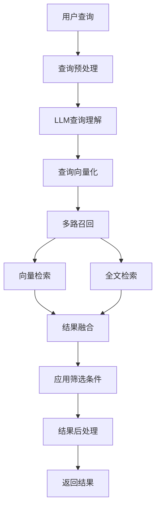

# 搜索引擎模块设计

## 架构概述
搜索引擎模块是小遥搜索的核心组件，负责处理用户的搜索查询，执行多模态检索，并返回相关的搜索结果。

## 核心组件设计

### 1. 查询处理器 (QueryProcessor)
**职责**: 解析用户查询，提取语义意图

**关键方法**:
```python
class QueryProcessor:
    def parse_query(self, query: str) -> ParsedQuery
    def extract_keywords(self, query: str) -> List[str]
    def parse_time_range(self, query: str) -> Optional[TimeRange]
    def detect_file_types(self, query: str) -> List[str]
```

**处理流程**:
1. 文本清洗和标准化
2. 中文分词（使用jieba）
3. 关键词提取
4. 时间表达式识别
5. 文件类型识别
6. 生成语义化查询描述

### 2. 多模态检索器 (MultiModalRetriever)
**职责**: 执行向量搜索和全文搜索

**核心算法**:
- **向量搜索**: 使用BGE模型将查询向量化，Faiss进行余弦相似度搜索
- **全文搜索**: 使用Whoosh的BM25算法进行关键词匹配

**关键配置**:
```python
class RetrievalConfig:
    vector_weight: float = 0.6      # 向量搜索权重
    text_weight: float = 0.4        # 全文搜索权重
    vector_top_k: int = 50          # 向量搜索返回数量
    text_top_k: int = 50            # 全文搜索返回数量
    final_top_k: int = 20           # 最终返回数量
```

### 3. 结果融合器 (ResultFusion)
**职责**: 使用RRF算法融合多路召回结果

**RRF算法实现**:
```python
def reciprocal_rank_fusion(vector_results, text_results, k=60):
    """
    RRF算法: score = Σ(weight / (k + rank))
    k通常取60，用于平衡排名影响
    """
    scores = {}
    for rank, doc_id in enumerate(vector_results):
        scores[doc_id] = scores.get(doc_id, 0) + 0.6 / (k + rank + 1)

    for rank, doc_id in enumerate(text_results):
        scores[doc_id] = scores.get(doc_id, 0) + 0.4 / (k + rank + 1)

    return sorted(scores.items(), key=lambda x: x[1], reverse=True)
```

### 4. 结果处理器 (ResultProcessor)
**职责**: 生成摘要、高亮关键词、格式化输出

**摘要生成策略**:
- 提取匹配段落的上下文
- 控制摘要长度在150字符以内
- 保持内容的连贯性

## 数据流程设计

### 搜索流程


### 查询理解管道
1. **文本预处理**: 去除特殊字符、标准化
2. **语言检测**: 自动识别中文/英文
3. **分词处理**: 中文使用jieba分词
4. **实体识别**: 识别时间、文件类型等实体
5. **意图分析**: 使用LLM理解查询意图

## 性能优化策略

### 1. 查询缓存
- **缓存策略**: LRU (最近最少使用)
- **缓存大小**: 100个查询
- **有效期**: 5分钟
- **缓存键**: 查询内容 + 筛选条件组合

### 2. 并行检索
- 向量搜索和全文搜索并行执行
- 使用asyncio异步编程
- 减少总体响应时间

### 3. 索引优化
- Faiss索引使用IVF_FLAT类型
- 预计算常用查询向量
- 定期优化索引结构

## 接口设计

### REST API
```
GET /api/v1/search
Parameters:
- q: 查询字符串 (必需)
- type: 文件类型筛选 (可选)
- start_date: 开始日期 (可选)
- end_date: 结束日期 (可选)
- size: 返回数量 (默认20)
- page: 页码 (默认1)
```

### 响应格式
```json
{
  "query": "机器学习算法",
  "total": 156,
  "results": [
    {
      "id": "doc_123",
      "title": "深度学习基础.pdf",
      "path": "/Documents/深度学习基础.pdf",
      "size": 2048576,
      "modified_time": "2024-11-08T10:30:00Z",
      "file_type": "pdf",
      "score": 0.95,
      "summary": "本文档介绍了<mark>机器学习算法</mark>的基本概念...",
      "highlights": ["机器学习算法", "深度学习"]
    }
  ],
  "search_time": 0.234,
  "suggestions": ["深度学习", "神经网络", "AI算法"]
}
```

## 错误处理

### 异常类型
1. **IndexNotFoundError**: 索引不存在
2. **QueryTimeoutError**: 查询超时
3. **InvalidQueryError**: 无效查询
4. **ServiceUnavailableError**: 服务不可用

### 处理策略
- 优雅降级：部分功能不可用时提供基础搜索
- 用户友好提示：清晰的错误信息
- 自动重试：临时性错误自动重试
- 日志记录：详细记录错误信息用于调试

## 扩展性设计

### 插件化架构
- 查询处理器支持插件扩展
- 检索器支持新的检索算法
- 结果处理器支持自定义格式化

### 多语言支持
- 查询理解支持多语言
- 分词器支持多种语言
- 时间解析支持不同语言表达

## 监控与指标

### 关键指标
- 搜索响应时间 (P95 < 1s)
- 查询命中率
- 结果相关性分数
- 缓存命中率

### 监控方法
- 响应时间分布统计
- 错误率监控
- 用户行为分析
- 系统资源使用监控